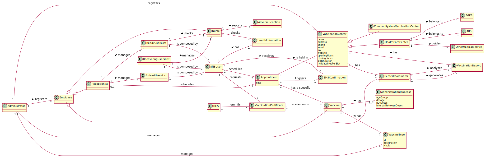

# OO Analysis

The construction process of the domain model is based on the client specifications, especially the nouns (for _concepts_) and verbs (for _relations_) used.

## Rationale to identify domain conceptual classes

To identify domain conceptual classes, start by making a list of candidate conceptual classes inspired by the list of categories suggested in the book "Applying UML and Patterns: An Introduction to Object-Oriented Analysis and Design and Iterative Development".

### _Conceptual Class Category List_

**Business Transactions**

- VaccinationProcess

**Transaction Line Items**

- VaccineType

**Product/Service related to a Transaction or Transaction Line Item**

- Vaccine

**Transaction Records**

- VaccineAdministration; VaccinationScheduling; RegisterVaccine; RegisterNurse; RegisterReceptionist; CertificateIssuance; UserArrival; AdverseReaction;

**Roles of People or Organizations**

- Nurse; Coordinator; Receptionist; Administrator; SNSUser;

**Places**

- CommunityMassVaccinationCenter; HealthCareCenter; WaitingRoom; RecoveryRoom;

**Noteworthy Events**

- RegisterSNSUserArrival; VaccinationScheduling; ScheduleConfirmation; VaccinationAdministration; UserWaitingInRecoveryRoom; LeaveVaccinationCenter; CertificateIssuance; CheckUserMedicalHistory

**Physical Objects**

- Vaccine

**Descriptions of Things**

- VaccineType; OngoingOutbreak

**Catalogs**

- Vaccines

**Containers**

- ScheduledUsersList; WaitingUsersList; ReadyUsersList; RecoveringUsersList

**Elements of Containers**

- SNSUser

**Organizations**

- DGS; ARS; AGES

**Other External/Collaborating Systems**

- DGS; SMSSender; Slots;

**Records of finance, work, contracts, legamatters**

- Statistics; Charts; Report; VaccinationCertificate; SMSAuthorization

**Financial Instruments**

- ***

**Documents mentioned/used to perform some work**

- MedicalHistory

## **Rationale to identify associations between conceptual classes**

An association is a relationship between instances of objects that indicates a relevant connection and that is worth of remembering, or it is derivable from the List of Common Associations:

- **_Vaccine_** has a **_VaccineType_**
- **_HealthCareCenter_** belongs to a **_ARS_**
- **_HealthCareCenter_** belongs to a **_ACES_**
- **_CommunityMassVaccinationCenter_** is associated with an **_OngoingOutbreak_**
- **_CommunityMassVaccinationCenter_** has some **_VaccineTypes_** assigned
- **_SNSUser_** owns a **_MedicalHistory_**
- Each **_CommunityMassVaccinationCenter_** has a **_CenterCoordinator_**
- **_A_** ... **_B_**
- **_A_** ... **_B_**
- **_A_** ... **_B_**
- **_A_** ... **_B_**
- **_A_** ... **_B_**
- **_A_** ... **_B_**

| Concept (A)                    |  Association  |                    Concept (B) |
| ------------------------------ | :-----------: | -----------------------------: |
| Administrator                  |  configures   |                    VaccineType |
| Administrator                  |  configures   |                        Vaccine |
| Administrator                  |    manages    | CommunityMassVaccinationCenter |
| Administrator                  |    manages    |                   Receptionist |
| Administrator                  |    manages    |                          Nurse |
| Administrator                  |   registers   |                        SNSUser |
| Administrator                  |   registers   | CommunityMassVaccinationCenter |
| Administrator                  |   registers   |              CenterCoordinator |
| Administrator                  |   registers   |                   Receptionist |
| Administrator                  |   registers   |                          Nurse |
| CenterCoordinator              |   generates   |                   CenterReport |
| CenterCoordinator              |   analyses    |                   CenterReport |
| CommunityMassVaccinationCenter |  administers  |                       Vaccines |
| CommunityMassVaccinationCenter |      has      |              CenterCoordinator |
| CommunityMassVaccinationCenter |      has      |                   CenterReport |
| HealthcareCenter               |  administers  |                       Vaccines |
| HealthcareCenter               | is associated |                            ARS |
| HealthcareCenter               | is associated |                           ACES |
| Appointment                    | is associated |                        SNSUser |
| Appointment                    | is associated |                          Nurse |
| Appointment                    | is associated |                 VaccineDetails |
| Nurse                          |     emits     |      VaccineDigitalCertificate |
| Nurse                          |    checks     |                 UserHealthInfo |
| Nurse                          |    checks     |                  ReadyUserList |
| Nurse                          |    reports    |               AdverseReactions |
| Nurse                          |   registers   |             VaccinationDetails |
| Nurse                          |  forwards to  |                   RecoveryRoom |
| Nurse                          |    checks     |        VaccinationInstructions |
| SNS User                       |      has      |                 UserHealthInfo |
| SNS User                       |   schedules   |           VaccineOnApplication |
| SNS User                       |   requests    |      VaccineDigitalCertificate |
| SNS User                       |   schedules   |      VaccineAtHealthcareCenter |
| VaccineType                    |      has      |                        Vaccine |
| Lot number                     |      has      |                        Vaccine |
| Dosage                         |      has      |                    VaccineType |
| Age group                      |      has      |                    TypeVaccine |
| Age group                      |      has      |          SpecificNumberOfDoses |
| TimeIntervalDoses              |      has      |            SpecificVaccineType |
| Slot                           |      has      |                MaximumDuration |
| Slot                           |      has      |                MaximumVaccines |
| VaccinationCertificate         |      has      |                        Vaccine |
| Receptionist                   |   registers   |                   UserArrivals |
| Receptionist                   |   verifies    |                VaccineSchedule |
| Receptionist                   |   confirms    |                      UserReady |
| Receptionist                   |   schedules   |                        Vaccine |
| Receptionist                   |     sends     |             SNSUserWaitingRoom |
| System                         |     sends     |  RecoveryPeriodEndNotification |
| System                         |   verifies    |   PossibilityOfUserVaccination |
| System                         |     sends     |          SMSVaccineAppointment |

## Domain Model

**Do NOT forget to identify concepts attributes too.**

**Insert below the Domain Model Diagram in a SVG format**

