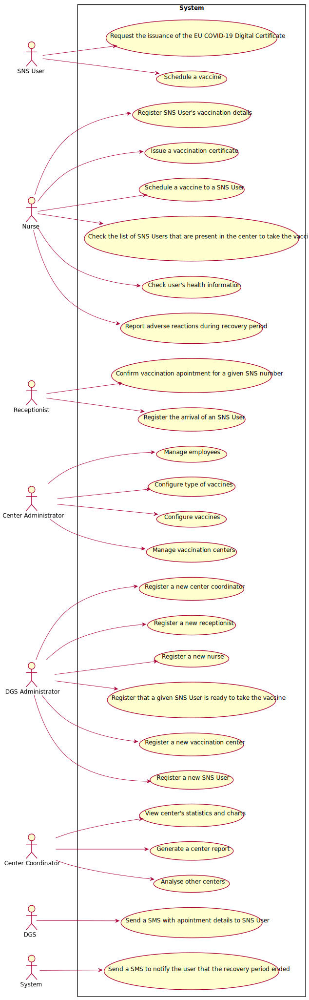

# Use Case Diagram (UCD)

**For each UC/US, it must be provided evidences of applying main activities of the software development process (requirements, analysis, design, tests and code). Gather those evidences on a separate file for each UC/US and set up a link as suggested below.**

# Use Cases / User Stories

| UC/US  | Description                  |
| :----- | :--------------------------- |
| US 001 | [ShortNameOfUS001](US001.md) |
| US 002 | [ShortNameOfUS002](US002.md) |
| US 003 | [ShortNameOfUS003](US003.md) |
| US 004 | [ShortNameOfUS004](US004.md) |
