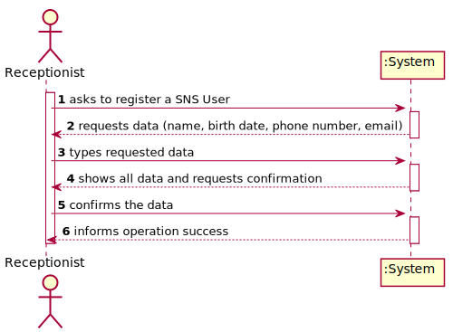
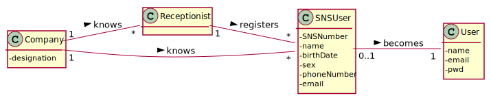
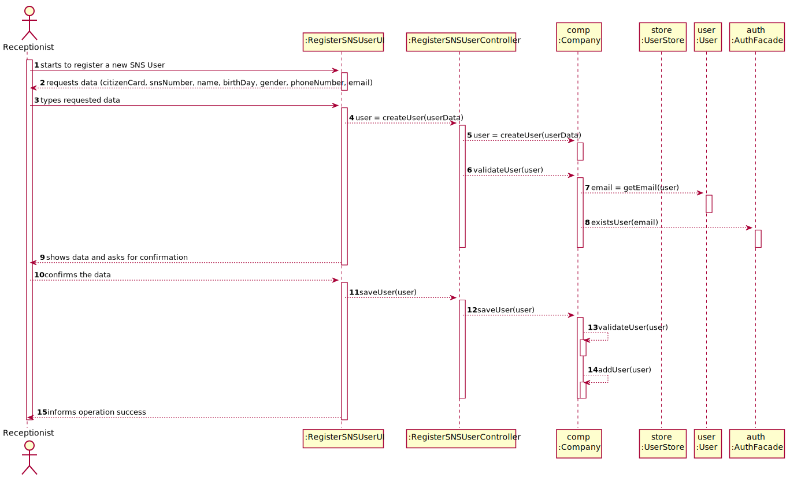

# US 03 - Register a new SNS user

## 1. Requirements Engineering

### 1.1. User Story Description

_"As a receptionist, I want to register a SNS User."_

### 1.2. Customer Specifications and Clarifications

**From the specifications document:**

> A SNS User is a person who is registered in the system.

> A SNS User must have an email, a password, a name, a birthday as well as a SNS number.

> Any Administrator uses the application to register SNS users.

> When the SNS user arrives at the vaccination center, a receptionist registers the arrival of the user to take the respective vaccine.

**From the client clarifications:**
<!-- TODO: update questions - check forum -->

> **Question:** Accordingly to our project description, the person allowed to register a SNS User is the Administrator. When the receptionist registers a SNS User, does he register the SNS user in the application or his arrival?
>
> **Answer:** —

> **Question:** What information should the receptionist ask the SNS user to insert in the application?
>
> **Answer:** —

> **Question:** Regarding US3: "As a receptionist, I want to register an SNS User". What are the necessary components in order to register an SNS User?
> 
> **Answer:** The attributes that should be used to describe a SNS user are: Name, Address, Sex, Phone Number, E-mail, Birth Date, SNS User Number and Citizen Card Number.
>             The Sex attribute is optional. All other fields are required.
>             The E-mail, Phone Number, Citizen Card Number and SNS User Number should be unique for each SNS user. 

### 1.3. Acceptance Criteria

<!-- TODO -->

-   **AC01:** All required fields must be filled in.
-   **AC02:** When creating a User with an already existing reference, the system must reject such operation and the user must have the change to modify the typed reference.
<!-- ? QUESTION -->
-   **AC03:** SNS number must have 9 digits.
-   **AC04:** Birth day must have the format: DD/MM/YYYY. A SNS User should not have more than 150 years of age.
<!-- ? QUESTION -->
-   **AC05:** Gender options: Male/Female.
<!-- ? QUESTION - also ask for every other property -->
-   **AC06:** Phone number must have 11 digits.
<!-- ? QUESTION -->
-   **AC07:** E-mail address must have 11 digits and validation must use a regular expression.
-   **AC08:** The password should be randomly generated. It should have 7 alphanumeric characters, 3 of them being upper case and 2 of them must be digits.
<!-- ? QUESTION -->
-   **AC09:** All input fields are required except gender.
<!-- ? QUESTION -->
-   **AC10:** The user receives an e-mail informing that the registration was successful and that he can start to use the system. The e-mail includes the user password. All the e-mail messages should be written to a file with the name emailAndSMSMessages.txt.

### 1.4. Found out Dependencies

-   No dependencies were found.

### 1.5 Input and Output Data

**Input Data:**

<!-- TODO -->

-   Typed data:
    -   Citizen Card number
    -   SNS number
    -   Name
    -   Birthday
    -   Phone number
    -   Email
    -   Address
-   Selected data:
    -   Gender

**Output Data:**

-   (In)Success of the operation

### 1.6. System Sequence Diagram (SSD)

**Alternative 1**

**Other alternatives might exist.**

### 1.7 Other Relevant Remarks

-   There are similarities between this user story and the US10 regarding the need to generate a password for the user account.

## 2. OO Analysis

### 2.1. Relevant Domain Model Excerpt

### 2.2. Other Remarks

n/a

## 3. Design - User Story Realization

### 3.1. Rationale

**SSD - Alternative 1 is adopted.**

| Interaction ID                               | Question: Which class is responsible for... | Answer                    | Justification (with patterns)                                                                                     |
| :------------------------------------------- | :------------------------------------------ | :------------------------ | :---------------------------------------------------------------------------------------------------------------- |
| Step 1: register SNS User                    | ... registering a new SNS User?             | RegisterSNSUserUI         | **Pure Fabrication:** there is no reason to assign this responsibility to any existing class in the Domain Model. |
|                                              | ... coordinating the US?                    | RegisterSNSUserController | **Controller**                                                                                                    |
|                                              | ... instantiating a new SNS User?           | Company                   | **Creator (Rule 1):**                                                                                             |
| Step 2: requests data                        | n/a                                         |                           |                                                                                                                   |
| Step 3: types the requested data             | ... saving the inputted data?               | User                      | IE: object created in step 1 has its own data.                                                                    |
| Step 4: shows data and asks for confirmation | ... saving the selected category?           | User                      | IE: object created in step 1 has one gender.                                                                      |
| Step 5: confirms the data                    | ... saving the user?                        | Company                   | IE: owns all users.                                                                                               |
| Step 6: informs operation success            | ... informing operation success?            | RegisterSNSUserUI         | IE: is responsible for user interactions.                                                                         |

### Systematization

According to the taken rationale, the conceptual classes promoted to software classes are:

-   Employee
-   SNSUser

Other software classes (i.e. Pure Fabrication) identified:

-   CreateSNSUserUI
-   CreateSNSUserController
-   **PasswordGenerator**
-   **EmailNotificationSender**

Other software classes of external systems/components:

-   AuthFacade

## 3.2. Sequence Diagram (SD)

**Alternative 1**

## 3.3. Class Diagram (CD)

**From alternative 1**

# 4. Tests

**Test 1:** Check that it is not possible to create an instance of the SNSUser class with null values.

    @Test(expected = IllegalArgumentException.class)
    	public void ensureNullIsNotAllowed() {
    	SNSUser instance = new SNSUser(null, null, null, null, null);
    }

**Test 2:** Check that it is not possible to create an instance of the SNSUser class with an SNS number containing more than 9 digits.

    @Test(expected = IllegalArgumentException.class)
    	public void ensureReferenceMeetsAC2() {
    	Date birthDay = new Date();

    	SNSUser instance = new SNSUser("12345678901", "Nome", "email@example.com", "+351910000000", birthDay);
    }

_It is also recommended to organize this content by subsections._

# 5. Construction (Implementation)

## Class CreateTaskController

    public boolean createTask(String ref, String designation, String informalDesc,
    	String technicalDesc, Integer duration, Double cost, Integer catId)() {

    	Category cat = this.platform.getCategoryById(catId);

    	Organization org;
    	// ... (omitted)

    	this.task = org.createTask(ref, designation, informalDesc, technicalDesc, duration, cost, cat);

    	return (this.task != null);
    }

## Class Organization

    public Task createTask(String ref, String designation, String informalDesc,
    	String technicalDesc, Integer duration, Double cost, Category cat)() {

    	Task task = new Task(ref, designation, informalDesc, technicalDesc, duration, cost, cat);
    	if (this.validateTask(task))
    		return task;
    	return null;
    }

# 6. Integration and Demo

-   A new SNS User is created into the system.

<!-- * A new option on the Employee menu options was added. -->

<!-- * Some demo purposes some tasks are bootstrapped while system starts. -->

# 7. Observations

<!-- TODO -->

Platform and Organization classes are getting too many responsibilities due to IE pattern and, therefore, they are becoming huge and harder to maintain.

Is there any way to avoid this to happen?
