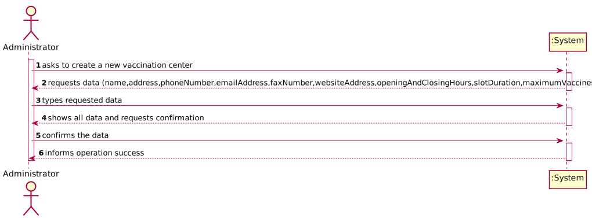
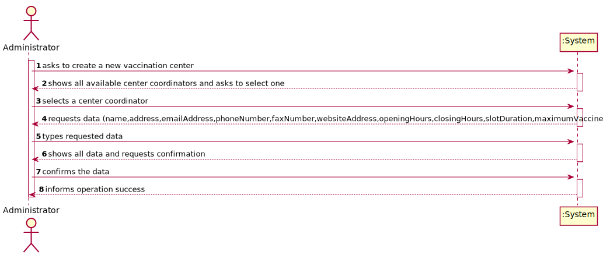
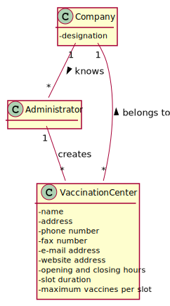
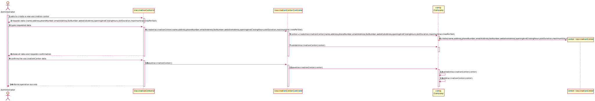
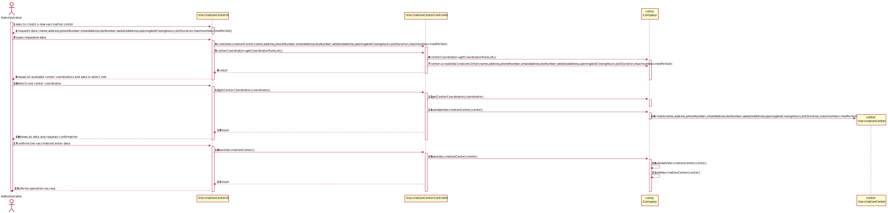
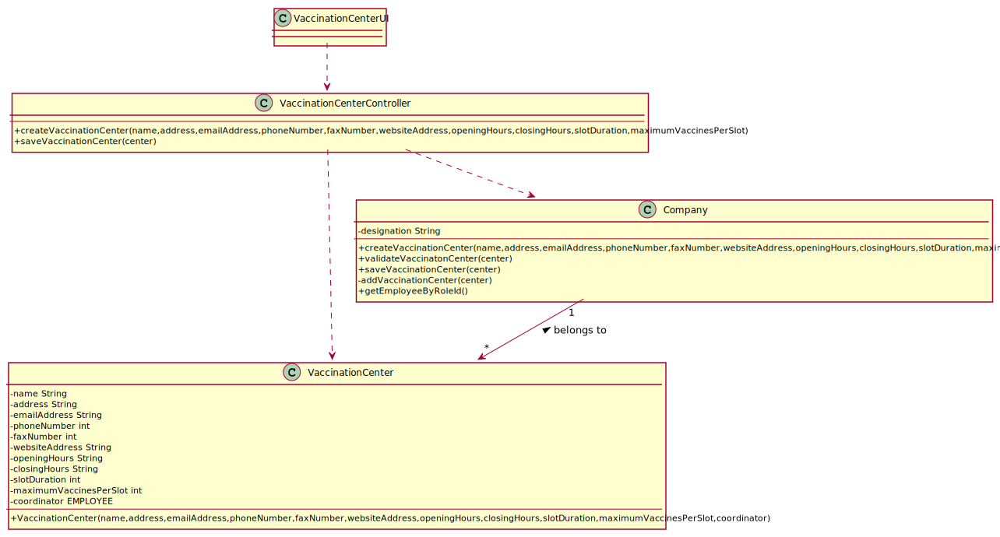

# US 09 - Register a vaccination center to respond to a certain pandemic 

## 1. Requirements Engineering

### 1.1. User Story Description

_"As an administrator, I want to register a vaccination center to respond to a certain pandemic."_

### 1.2. Customer Specifications and Clarifications 

**From the specifications document:**

>	"[...] vaccination centers are facilities specifically created to administer vaccines of a single type as
response to an ongoing disease outbreak (e.g.: Covid-19)."

> "Each vaccination center has a Center Coordinator [...]"

>	"[...] vaccination centers are characterized by a name, an address, a phone number, an e-mail address, a
fax number, a website address, opening and closing hours, slot duration (e.g.: 5 minutes) and the
maximum number of vaccines that can be given per slot (e.g.: 10 vaccines per slot)." 

**From the client clarifications:**

> **Question:** Is there any specification about the name, phone number,email address, address, fax number, website address, opening and closing hours, slot duration and maximum number of vaccines?
>  
> **Answer:** ?

### 1.3. Acceptance Criteria

* **AC1:** Each center mush have one Center Coordinator.
* **AC2:** All required fields must be filled in.
* **AC3:** When creating a new Vaccination Center, validate that there isn´t already one existing with the same references.

### 1.4. Found out Dependencies

* There is a dependency to "US10 - Register an Employee	" since at least one Center Coordinator must be designated to a Vaccination Center for it to be created.

### 1.5 Input and Output Data

**Input Data:**

* Typed data:
	* an name;
	* an address;
	* email address
	* a phone number;
	* a fax number;
	* website address;
	* opening hours;
	* closing hours;
	* slot duration;
	* maximum vaccines per slot. 
* Selected data:
    * center coordinator.	
  
**Output Data:**
* List of existing center coordinators;
* (In)Success of the operation.

### 1.6. System Sequence Diagram (SSD)

**Alternative 1**

**Alternative 2**

### 1.7 Other Relevant Remarks

* There are similarities between this user story and the US11 regarding the method getEmployeeByRoleId() which is used to get center coordinators.

## 2. OO Analysis

### 2.1. Relevant Domain Model Excerpt 

### 2.2. Other Remarks

* Not found.

## 3. Design - User Story Realization 

### 3.1. Rationale

#### From the alternative 1

| Interaction ID                                                                                                                                      | Question: Which class is responsible for...     | Answer            | Justification (with patterns)                              |
| :-------------------------------------------------------------------------------------------------------------------------------------------------- | :---------------------------------------------- | :---------------- | :--------------------------------------------------------- |
| Step 1: starts creating a new vaccination center                                                                                                    | ... instantiating a new Vaccination center?     | Company           | Creator: R1/2                                              |
| Step 2: request data(name,address,emailAddress,phoneNumber,faxNumber,websiteAddress,openingHours,closingHours,slotDuration, maximumVaccinesPerSlot) | n/a                                             | n/a               | n/a                                                        |
| Step 3: types requested data                                                                                                                        | ... saving the inputted data?                   | VaccinationCenter | IE: object created in step 1 has its own data.             |
| Step 4: shows all available center coordinators and asks to select one                                                                              | ... listing all the center coordinators         | Company           | IE: knows all the existing center coordinators.            |
| Step 5: selects a center coordinator                                                                                                                | n/a                                             | n/a               | n/a                                                        |
| Step 6: shows the data and requests a confirmation                                                                                                  | ... validating the data introduced?             | Company           | IE: holds every information about centers.                 |
|                                                                                                                                                     | ... validating the data introduced?             | VaccinationCenter | IE: knows its own data.                                    |
| Step 7: confirms the data                                                                                                                           | ... saving the new created Vaccination Center?  | Company           | IE: holds every information about the vaccination process. |
| Step 8: informs operation success                                                                                                                   | ... informing that the operation was a success? | UI                | IE: responsible for user interaction.                      |

#### From the alternative 2

| Interaction ID                                                                                                                                      | Question: Which class is responsible for...     | Answer            | Justification (with patterns)                              |
| :-------------------------------------------------------------------------------------------------------------------------------------------------- | :---------------------------------------------- | :---------------- | :--------------------------------------------------------- |
| Step 1: starts creating a new vaccination center                                                                                                    | ... instantiating a new Vaccination center?     | Company           | Creator: R1/2                                              |
| Step 2: shows all available center coordinators and asks to select one                                                                              | ... listing all the center coordinators         | Company           | IE: knows all the existing center coordinators.            |
| Step 3: selects a center coordinator                                                                                                                | n/a                                             | n/a               | n/a                                                        |
| Step 4: request data(name,address,emailAddress,phoneNumber,faxNumber,websiteAddress,openingHours,closingHours,slotDuration, maximumVaccinesPerSlot) | n/a                                             | n/a               | n/a                                                        |
| Step 5: types requested data                                                                                                                        | ... saving the inputted data?                   | VaccinationCenter | IE: object created in step 1 has its own data.             |
| Step 6: shows the data and requests a confirmation                                                                                                  | ... validating the data introduced?             | Company           | IE: holds every information about centers.                 |
|                                                                                                                                                     | ... validating the data introduced?             | VaccinationCenter | IE: knows its own data.                                    |
| Step 7: confirms the data                                                                                                                           | ... saving the new created Vaccination Center?  | Company           | IE: holds every information about the vaccination process. |
| Step 8: informs operation success                                                                                                                   | ... informing that the operation was a success? | UI                | IE: responsible for user interaction.                      |

### Systematization ##

According to the taken rationale, the conceptual classes promoted to software classes are: 

 * VaccinationCenter
 * Company

Other software classes (i.e. Pure Fabrication) identified: 

 * CreateVaccinationCenterUI  
 * CreateVaccinationCenterController

## 3.2. Sequence Diagram (SD)

### Alternative 1

### Alternative 2

## 3.3. Class Diagram (CD)

# 4. Tests 
// Test without 1 parameter address (String)
// Test without 1 parameter phone number (int)
// Test with null values
// ---

**Test 1:** Check that it is not possible to create an instance of the VaccinationCenter class without the parameter address. 

	@Test(expected = IllegalArgumentException.class)
		public void ensureNullIsNotAllowed() {
		VaccinationCenter center = new VaccinationCenter("Centro Vacinação Porto", "Rua João Almeida", 221010101,"vacinacaoporto@gmail.com", +351-122-123123123, "www.centrovacinaoporto.com", "8:00-19:00", 5, 10);
	}
	
**Test 2:** Check that it is not possible to create an instance of the VaccinationCenter class without the parameter slot duration.

	@Test(expected = IllegalArgumentException.class)
		public void ensureIntegerParameterIsNotNull() {
		VaccinationCenter center = new VaccinationCenter("Centro Vacinação Porto", "Rua João Almeida", 221010101,"vacinacaoporto@gmail.com", +351-122-123123123, "www.centrovacinaoporto.com", "8:00-19:00", 0, 10);
	}

**Test 3** Check that it is not possible to create an instance of the VaccinationCenter class with null values.
	
	@Test(expected = IllegalArgumentException.class)
		public void ensureReferenceMeetsAC2() {
			VaccinationCenter center = new VaccinationCenter(null,null,null,null,null,null,null,null,null);
		}

# 5. Construction (Implementation)

## Class CreateTaskController 

		public boolean VaccinationCenterController(String ref, String designation, String informalDesc, 
			String technicalDesc, Integer duration, Double cost, Integer catId)() {
		
			Category cat = this.platform.getCategoryById(catId);
			
			Organization org;
			// ... (omitted)
			
			this.task = org.createTask(ref, designation, informalDesc, technicalDesc, duration, cost, cat);
			
			return (this.task != null);
		}

## Class Organization

		public Task VaccinationCenter(String ref, String designation, String informalDesc, 
			String technicalDesc, Integer duration, Double cost, Category cat)() {
		
	
			Task task = new Task(ref, designation, informalDesc, technicalDesc, duration, cost, cat);
			if (this.validateTask(task))
				return task;
			return null;
		}

# 6. Integration and Demo 

* A new option on the Employee menu options was added.

* Some demo purposes some tasks are bootstrapped while system starts.

# 7. Observations

Platform and Organization classes are getting too many responsibilities due to IE pattern and, therefore, they are becoming huge and harder to maintain. 

Is there any way to avoid this to happen?