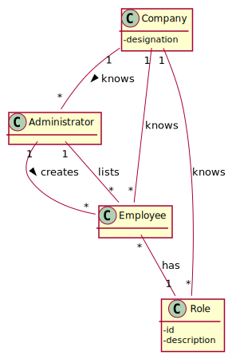
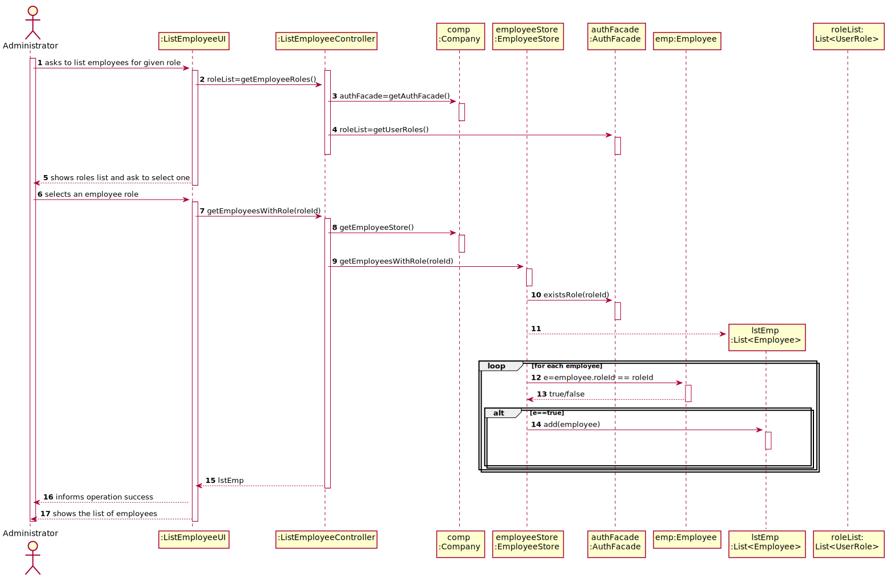
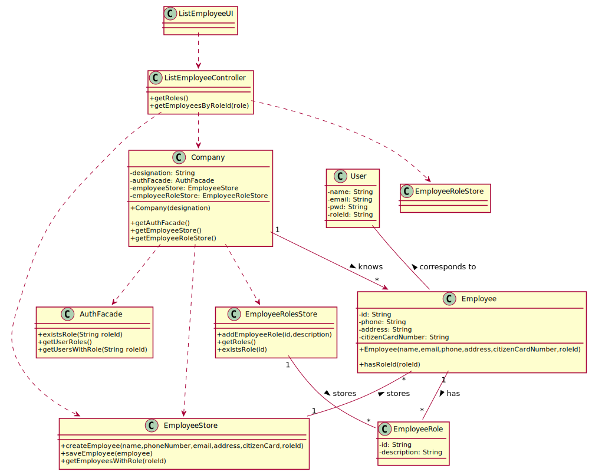

# US 11 - Get Employees List by Role

## 1. Requirements Engineering

### 1.1. User Story Description

_"As an Administrator, I want to get a list of Employees with a given function/role."_

### 1.2. Customer Specifications and Clarifications

**From the specifications document:**

> "[...] receptionists and nurses registered in the application will work in the vaccination process."

> "[...] each vaccination center has one coordinator."

**From Client Clarifications**

> "The application should present all Employee attributes."

> "For now I just want to get a list of employees without considering the order of presentation."

> "The Administrator should select a given role and all employees associated with the selected role should be listed."

### 1.3. Acceptance Criteria

- **AC1: The selected role must be defined in the constants class**

### 1.4. Found out Dependencies

- There is a dependency to "US10 Register Employee" since at least an employee type must exist to specify the role pretended.

### 1.5 Input and Output Data

**Input Data:**

- Typed data:
  - none
- Selected data:
  - function/role

**Output Data:**

- List of employees for given function/role
- (In)Success of the operation

### 1.6. System Sequence Diagram (SSD)

**Alternative 1**

**Other alternatives might exist.**

### 1.7 Other Relevant Remarks

- Not found.

## 2. OO Analysis

### 2.1. Relevant Domain Model Excerpt

### 2.2. Other Remarks

Not found.

## 3. Design - User Story Realization

### 3.1. Rationale

| Interaction ID                                                  | Question: Which class is responsible for... | Answer            | Justification (with patterns)                                                                                 |
| :-------------------------------------------------------------- | :------------------------------------------ | :---------------- | :------------------------------------------------------------------------------------------------------------ |
| Ask to list employees for a given role                          | ... displaying the screen to the user       | UI                | Pure Fabrication: there is no reason to assign this responsibility to any existing class in the Domain Model. |
| Show roles list and ask to select one                           | ... listing all roles?                      | EmployeeRoleStore | IE: knows all the existing roles                                                                              |
| Select role                                                     | n/a                                         | n/a               | n/a                                                                                                           |
| Generate employees list for a given role                        | ... knowing all the employees               | EmployeeStore     | IE: knows all the existing employees                                                                          |
|                                                                 | ... filtering by role                       | Employee          | IE: knows it's attributes                                                                                     |
| Informs operation success and list all employees for given role | ... informing operation success?            | UI                | IE: responsible for user interaction                                                                          |

### Systematization

According to the taken rationale, the conceptual classes promoted to software classes are:

- Employee
- EmployeeStore
- EmployeeRoleStore
- UserRole

Other software classes (i.e. Pure Fabrication) identified:

- ListEmployeeUI
- ListEmployeeController

## 3.2. Sequence Diagram (SD)

**Alternative 1**

## 3.3. Class Diagram (CD)

**From alternative 1**

# 4. Tests

**Test 1:** Check that it is not possible to list employees with null Role.

    @Test(expected = IllegalArgumentException.class)
    	public void ensureNullIsNotAllowed() {
    	List empList = listEmployeesByRole(null);
    }

**Test 2:** Check that it is not possible to list employees with non existing role.

    @Test(expected = IllegalArgumentException.class)
    	public void ensureReferenceMeetsAC1() {
    	List empList = getEmployeesByRole("NotValidRole");
    }

# 5. Construction (Implementation)

## Class ListEmployeesByRoleController

    public List<Employee> listEmployeesWithRole(String roleId) {
      return employeeStore.getEmployeesWithRole(roleId);
    }

## Employee Store

    public List<Employee> getEmployeesWithRole(String roleId) {
      if (roleId == null) throw new IllegalArgumentException("Role id cannot be null");
      if (!roleStore.existsRole(roleId)) throw new IllegalArgumentException("Role does not exist");

      List<Employee> lstEmp = new ArrayList<>();

      for (Employee employee : employees)
        if (employee.hasRoleId(roleId)) lstEmp.add(employee);

      return lstEmp;

}

# 6. Integration and Demo

- A new option on the Employee menu options was added.

- Some demo purposes some tasks are bootstrapped while system starts.

# 7. Observations

There is no class relation between Employee and User to enforce both to exist in the first place in the code.

The relation between them is made by corresponding e-mail (unique attribute in both)
