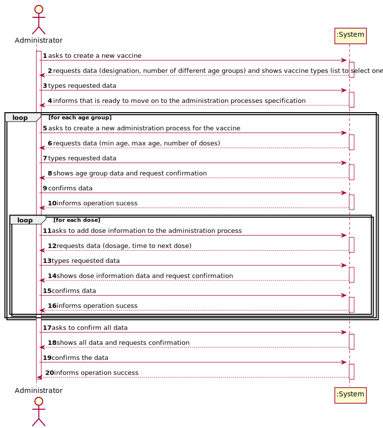
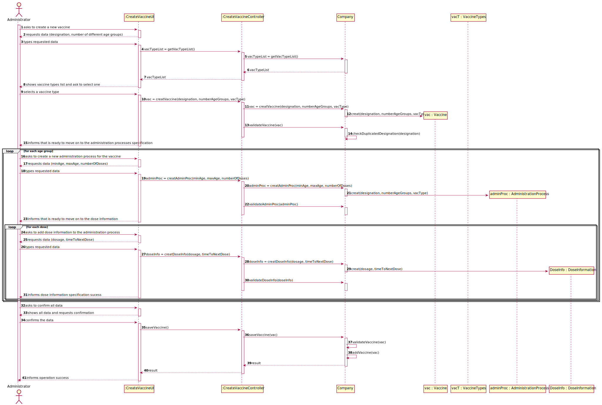

# US 12 - Specify a new vaccine and its administration process

## 1. Requirements Engineering

### 1.1. User Story Description

_"As an Administrator, I intend to specify a new vaccine and its administation process."_

### 1.2. Customer Specifications and Clarifications 

**From the specifications document:**

>	An Administrator is responsible for properly configuring and managing the core information (e.g.:
type of vaccines, vaccines, vaccination centers, employees) required for this application [...]

>   [...] several vaccines might exist, each one demanding a distinct administration process.

>   The vaccine administration process comprises (i) one or more age groups (e.g.: 5 to 12 years old, 13 to 18 years
old, greater than 18 years old), and (ii) per age group, the doses to be administered (e.g.: 1, 2, 3), the
vaccine dosage (e.g.: 30 ml), and the time interval regarding the previously administered dose.

>    [...]  between doses (e.g.: between the 1st and 2nd doses) the
dosage to be administered might vary as well as the time interval elapsing between two consecutive
doses (e.g.: between the 1st and 2nd doses 21 days might be required, while between the 2nd and the
3rd doses 6 months might be required).

>   [...] for each type of vaccine, several vaccines might exist,

**From the client clarifications:**

> **Question:** 
>   As to the interval between doses, what time format are we to use?
> **Answer:** 
	Number of days.

-

> **Question:** 
>  Which attributes does the Vaccine have (besides the ones refering to the Vaccine Type)?
> **Answer:** 
   Each vaccine has the following attributes: Id, Name, Brand, Vaccine Type, Age Group, Dose Number, Vaccine Dosage and Time Since Last Dose.

### 1.3. Acceptance Criteria

* **AC1:** All required fiedls must be filled in.
* **AC2:** When creating a vaccine, the vaccine type must existe.
* **AC3:** The age group intervals limits, the dosage, the time since last dose and the number of doses must be positive integers.
* **AC4** In the age gorup interval, the minimum age must be smaller than the maximum age.
* **AC5:** When creating a vaccine with an already existing designation, the system must reject such operation and the user must have the chance to modify the typed designation.

### 1.4. Found out Dependencies

* There is a dependency to "US12 - Specify a new Vaccine Type" since at least a vaccine type must exist to classify new vaccine being created.

### 1.5 Input and Output Data

**Input Data:**

* Typed data:
  - Vaccine ID
  - Vaccine designation
  - Vaccine brand
  - Age group interval limits
  - Dosage
  - Number of doses
  - Time interval between doses
* Selected data:
  - Vaccine type

**Output Data:**

- (In)Success of the operation

### 1.6. System Sequence Diagram (SSD)

**Alternative 1**

**Alternative 2**

**Other alternatives might exist.**

### 1.7 Other Relevant Remarks

* Not found

## 2. OO Analysis

### 2.1. Relevant Domain Model Excerpt 

### 2.2. Other Remarks

n/a

## 3. Design - User Story Realization 

### 3.1. Rationale

TODO : review, implement stores and lists
**SSD - Alternative 2 is adopted.**

| Interaction ID | Question: Which class is responsible for... | Answer  | Justification (with patterns)  |
|:-------------  |:--------------------- |:------------|:---------------------------- |
| Step 1 		 |	... displaying the screen to the user? | CreateVaccineUI   |  Pure Fabrication: there is no reason to assign this responsibility to any existing class in the Domain Model.           |
|	| ... coordinating the US	| CreateVaccineController	| Pure Fabrication: Controller 	|
| Step 2 		 |	... request data? | CreateVaccineUI | IE: Responsible for user interactions.                            |
| Step 3  		 |	... instantiating a new vaccine? | VaccineStore   | Creator: R1/2.   |
| 			  	 |  ... validating data?(locally)  | Vaccine  | IE: Owns the data.  |
| 			  	 |  ... validating data?(globally)  | VaccineStore  | IE: Knows all data (e.g. make sure it doesnt have the same name as other vaccine).  |
| Step 4		 |  ... inform the  current state of the process | CreateVaccineUI | Pure Fabrication: Responsible for user interactions. |
| Step 5		 |  |||
| Step 6 		 |	... request data?| CreateVaccineUI | Pure Fabrication: Responsible for user interactions.                |
| Step 7		 |	... instantiating a new adminsitration process	| AdminProcList	| Creator: R1. |
|				 |	... validating data? |	AdminsitrationProcess	| IE: Owns the data. |
| Step 8		 |  ... show all the data and request confirmation?	|	CreateVaccineUI	|  Pure Fabrication: Responsible for user interactions.	|
| step 9 | ... add the administration process| AdminProcList | IE: stores administration processes|
| Step 10		 |  ... inform operation sucess? | CreateVaccineUI | Pure Fabrication: Responsible for user interactions.	|
| step 11 ||||
| Step 12 		 |	... request data? | CreateVaccineUI | Pure Fabrication: Responsible for user interactions.                  |
| Step 13		 |	... instantiating a new dose information	| DoseInfoList	| Creator: R1 |
|				 |	... validating data? |	DoseInfo	| IE: Owns the data. |
| Step 14		 |  ... show all the data and request confirmation?	|	CreateVaccineUI	|  Pure Fabrication: Responsible for user interactions.	|
| step 15 | ... add the dose information| DoseInfoList | IE: Stores dose informations|
| Step 16		 |  ... informing operation sucess?	|	CreateVaccineUI	|  Pure Fabrication: Responsible for user interactions.	|
| Step 17 ||||
| Step 18		 |  ... show all the data and request confirmation?	|	CreateVaccineUI	|  Pure Fabrication: Responsible for user interactions.	|
| Step 19 | ...store the final result of the vaccine | VaccineStore| IE: Stores all vaccines|
| Step 20		 |  ... informing operation sucess?	|	CreateVaccineUI	|  Pure Fabrication: Responsible for user interactions.	|

### Systematization ##

According to the taken rationale, the conceptual classes promoted to software classes are: 

 * Company
 * Vaccine
 * VaccineType
 * AdministrationProcess
 * DoseInformation

Other software classes (i.e. Pure Fabrication) identified: 

 * CreateVaccineUI
 * CreateVaccineController  

## 3.2. Sequence Diagram (SD)

**Alternative 2**

## 3.3. Class Diagram (CD)

**From alternative 2**

# 4. Tests 

* Vaccine

**Test 1:** Check that it is not possible to create an instance of the Vaccine class with null values. 

	@Test(expected = IllegalArgumentException.class)
		public void ensureNullIsNotAllowed() {
		Vaccine instance = new Vaccine(null, null, null, null);
	}
	

**Test 2:** Check that it is not possible to create an instance of the Vaccine class with empty values. 

	@Test(expected = IllegalArgumentException.class)
		public void ensureNullIsNotAllowed() {
		Vaccine instance = new Vaccine("", "", "", "");
	}
	

**Test 3:** Check that it is not possible to create an instance of the Vaccine class with a vaccine type id that does not exist. 

	@Test(expected = IllegalArgumentException.class)
		public void ensureNullIsNotAllowed() {
		Vaccine instance = new Vaccine("Pfizer–BioNTech COVID-19", "Pfizer", "vac1", "Not existing vacTypeID");
	}

* Administration Process

**Test 4:** Check that it is not possible to add an administration process with null values.

	@Test(expected = IllegalArgumentException.class)
		public void ensureNullIsNotAllowed() {
		Vaccine.addAdminProc(null, null, null);
	}

**Test 5:** Check that it is not possible to add an administration process with negative time interval values.

	@Test(expected = IllegalArgumentException.class)
		public void ensureNullIsNotAllowed() {
		Vaccine.addAdminProc(-10, -5, 3);
	}

**Test 6:** Check that it is not possible to add an administration process with non integer values.

	@Test(expected = IllegalArgumentException.class)
		public void ensureNullIsNotAllowed() {
		Vaccine.addAdminProc("minAge", "maxAge", 0.13);
	}

**Test 7:** Check that it is not possible to add an administration process with a max age smaller than the min age values.

	@Test(expected = IllegalArgumentException.class)
		public void ensureNullIsNotAllowed() {
		Vaccine.addAdminProc("18", "2", "3");
	}

* Dose Information
  
**Test 8:** Check that it is not possible to add a dose information with null values.

	@Test(expected = IllegalArgumentException.class)
		public void ensureNullIsNotAllowed() {
		AdminProc.addDoseInfo(null, null);
	}

**Test 9:** Check that it is not possible to add a dose information with non integer values.

	@Test(expected = IllegalArgumentException.class)
		public void ensureNullIsNotAllowed() {
		AdminProc.addDoseInfo("dosage", 0.10);
	}

**Test 10:** Check that it is not possible to add a dose information with negative time interval values.

	@Test(expected = IllegalArgumentException.class)
		public void ensureNullIsNotAllowed() {
		AdminProc.addDoseInfo(-10, -5);
	}

# 5. Construction (Implementation)

## Class CreateTaskController 

		public boolean createTask(String ref, String designation, String informalDesc, 
			String technicalDesc, Integer duration, Double cost, Integer catId)() {
		
			Category cat = this.platform.getCategoryById(catId);
			
			Organization org;
			// ... (omitted)
			
			this.task = org.createTask(ref, designation, informalDesc, technicalDesc, duration, cost, cat);
			
			return (this.task != null);
		}

## Class Organization

		public Task createTask(String ref, String designation, String informalDesc, 
			String technicalDesc, Integer duration, Double cost, Category cat)() {
		
	
			Task task = new Task(ref, designation, informalDesc, technicalDesc, duration, cost, cat);
			if (this.validateTask(task))
				return task;
			return null;
		}

# 6. Integration and Demo 

* A new option on the Employee menu options was added.

* Some demo purposes some tasks are bootstrapped while system starts.

# 7. Observations

Platform and Organization classes are getting too many responsibilities due to IE pattern and, therefore, they are becoming huge and harder to maintain. 

Is there any way to avoid this to happen?

