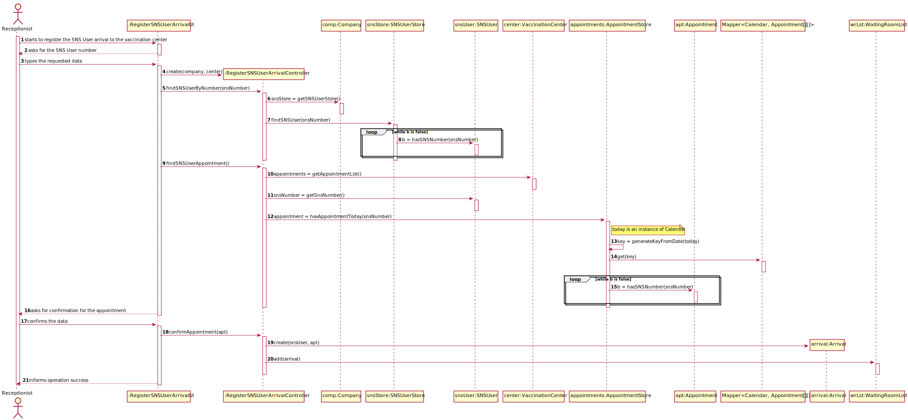
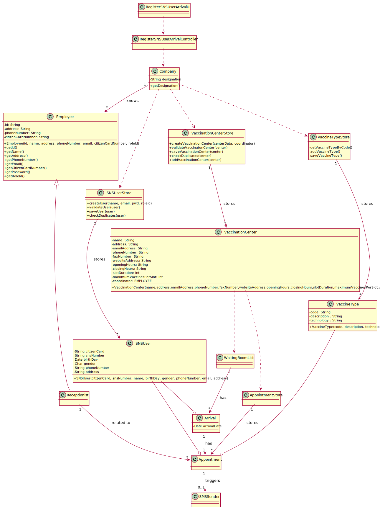

# US 04 - Register SNS User Arrival

## 1. Requirements Engineering

### 1.1. User Story Description

_"As a receptionist at a vaccination center, I want to register the arrival of a SNS user to take the vaccine."_

### 1.2. Customer Specifications and Clarifications

**From the specifications document:**

> When the SNS user arrives at the vaccination center, a receptionist registers the arrival of the user to take the respective vaccine.

> The receptionist asks the SNS user for his/her SNS user number and confirms that he/she has the vaccine scheduled for the that day and time.
> If the information is correct, the receptionist acknowledges the system that the user is ready to take the vaccine.
> Then, the receptionist should send the SNS user to a waiting room where (s)he should wait for his/her time.

**From the client clarifications:**

> **Question:** In this user story, the receptionist registers the arrival of an SNS User. Does the receptionist choose the center she works at during login like the nurse?
>
> **Answer:** To start using the application, the receptionist should first select the vaccination center where she is working. The receptionists register the arrival of a SNS user at the vaccination center where she is working.

> **Question:** Regarding US04, what are the attributes needed in order to register the arrival of a SNS user to a vaccination center?
>
> **Answer:** The time of arrival should be registered.

> **Question:** Regarding US04, should the attribute "arrival time" be considered the moment the user enters the waiting room?
> For example, a user that arrives 40 minutes after his appointment won't be allowed to enter the center, and another who only arrives 10 minutes late may proceed. If so, how much compensation time should we provide to the user?
>
> **Answer:** In this sprint we are not going to address the problem of delays. All arriving users are attended and registered by the receptionist.

> **Question:** Regarding US04, should the receptionist register the arrival of a SNS user immediately when he arrives at the vaccination center or only after the receptionist confirms that the respective user has a vaccine scheduled for that day and time?
>
> **Answer:** The receptionist registers the arrival of a SNS user only after confirming that the user has a vaccine scheduled for that day and time.

> **Question:** When the SNS user number is introduce by the receptionist and the system has no appointment for that SNS user number, how should the system proceed?
>
> **Answer:** The application should present a message saying that the SNS user did not scheduled a vaccination.

### 1.3. Acceptance Criteria

-   **AC1:** No duplicate entries should be possible for the same SNS user on the same day or vaccine period.
-   
### 1.4. Found out Dependencies

-   There is a dependency to "US03 Receptionist registers a SNS User" since at least one SNS User must exist to be able to check the appointments and register arrivals.

<!-- TODO: add missing dependencies -->

### 1.5 Input and Output Data

**Input Data:**

-   Typed data:
    -   the SNS Users' number

**Output Data:**

-   Appointment confirmation
-   (In)Success of the operation

### 1.6. System Sequence Diagram (SSD)

**Alternative 1**

<!-- **Other alternatives might exist.** -->

### 1.7 Other Relevant Remarks

<!-- TODO -->
<!-- -   The created task stays in a "not published" state in order to distinguish from "published" tasks. -->

## 2. OO Analysis

### 2.1. Relevant Domain Model Excerpt

### 2.2. Other Remarks

n/a

## 3. Design - User Story Realization

### 3.1. Rationale

<!-- **SSD - Alternative 1 is adopted.** -->

<!-- TODO -->

| Interaction ID | Question: Which class is responsible for...            | Answer               | Justification (with patterns)                                                                                 |
| :------------- | :----------------------------------------------------- | :------------------- | :------------------------------------------------------------------------------------------------------------ |
| Step 1         | ... interacting with the actor?                        | CreateTaskUI         | Pure Fabrication: there is no reason to assign this responsibility to any existing class in the Domain Model. |
|                | ... coordinating the US?                               | CreateTaskController | Controller                                                                                                    |
|                | ... instantiating a new Task?                          | Organization         | Creator (Rule 1): in the DM Organization has a Task.                                                          |
|                | ... knowing the user using the system?                 | UserSession          | IE: cf. A&A component documentation.                                                                          |
|                | ... knowing to which organization the user belongs to? | Platform             | IE: has registed all Organizations                                                                            |
|                |                                                        | Organization         | IE: knows/has its own Employees                                                                               |
|                |                                                        | Employee             | IE: knows its own data (e.g. email)                                                                           |
| Step 2         |                                                        |                      |                                                                                                               |
| Step 3         | ...saving the inputted data?                           | Task                 | IE: object created in step 1 has its own data.                                                                |
| Step 4         | ...knowing the task categories to show?                | Platform             | IE: Task Categories are defined by the Platform.                                                              |
| Step 5         | ... saving the selected category?                      | Task                 | IE: object created in step 1 is classified in one Category.                                                   |
| Step 6         |                                                        |                      |                                                                                                               |
| Step 7         | ... validating all data (local validation)?            | Task                 | IE: owns its data.                                                                                            |
|                | ... validating all data (global validation)?           | Organization         | IE: knows all its tasks.                                                                                      |
|                | ... saving the created task?                           | Organization         | IE: owns all its tasks.                                                                                       |
| Step 8         | ... informing operation success?                       | CreateTaskUI         | IE: is responsible for user interactions.                                                                     |

### Systematization

According to the taken rationale, the conceptual classes promoted to software classes are:

-   Arrival

Other software classes (i.e. Pure Fabrication) identified:

-   RegisterSNSUserArrivalUI
-   RegisterSNSUserArrivalController

## 3.2. Sequence Diagram (SD)

**Alternative 1**

## 3.3. Class Diagram (CD)

**From alternative 1**

# 4. Tests
<!-- TODO -->
**Test 1:** Check that it is not possible to create an instance of the Task class with null values.

    @Test(expected = IllegalArgumentException.class)
    	public void ensureNullIsNotAllowed() {
    	Task instance = new Task(null, null, null, null, null, null, null);
    }

**Test 2:** Check that it is not possible to create an instance of the Task class with a reference containing less than five chars - AC2.

    @Test(expected = IllegalArgumentException.class)
    	public void ensureReferenceMeetsAC2() {
    	Category cat = new Category(10, "Category 10");

    	Task instance = new Task("Ab1", "Task Description", "Informal Data", "Technical Data", 3, 3780, cat);
    }

_It is also recommended to organize this content by subsections._

# 5. Construction (Implementation)
<!-- TODO -->
## Class CreateTaskController

    	public boolean createTask(String ref, String designation, String informalDesc,
    		String technicalDesc, Integer duration, Double cost, Integer catId)() {

    		Category cat = this.platform.getCategoryById(catId);

    		Organization org;
    		// ... (omitted)

    		this.task = org.createTask(ref, designation, informalDesc, technicalDesc, duration, cost, cat);

    		return (this.task != null);
    	}

## Class Organization

    	public Task createTask(String ref, String designation, String informalDesc,
    		String technicalDesc, Integer duration, Double cost, Category cat)() {

    		Task task = new Task(ref, designation, informalDesc, technicalDesc, duration, cost, cat);
    		if (this.validateTask(task))
    			return task;
    		return null;
    	}

# 6. Integration and Demo

-   A new Arrival is created.
-   This Arrival will appear in the Waiting Room List, checked by the nurse.

# 7. Observations
<!-- TODO -->
Platform and Organization classes are getting too many responsibilities due to IE pattern and, therefore, they are becoming huge and harder to maintain.

Is there any way to avoid this to happen?
