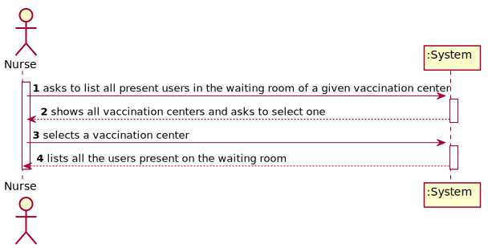
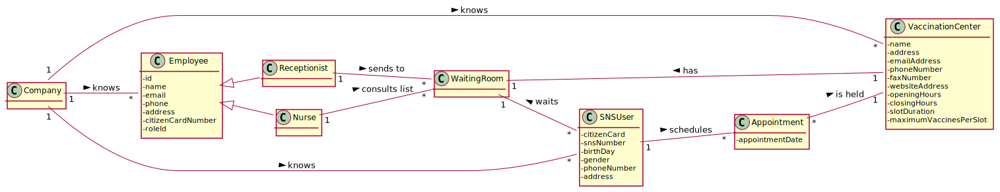
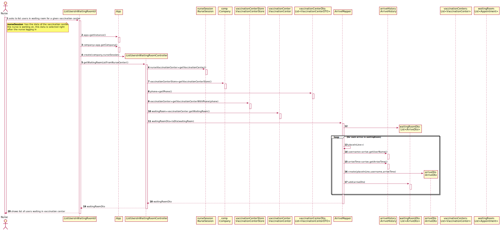
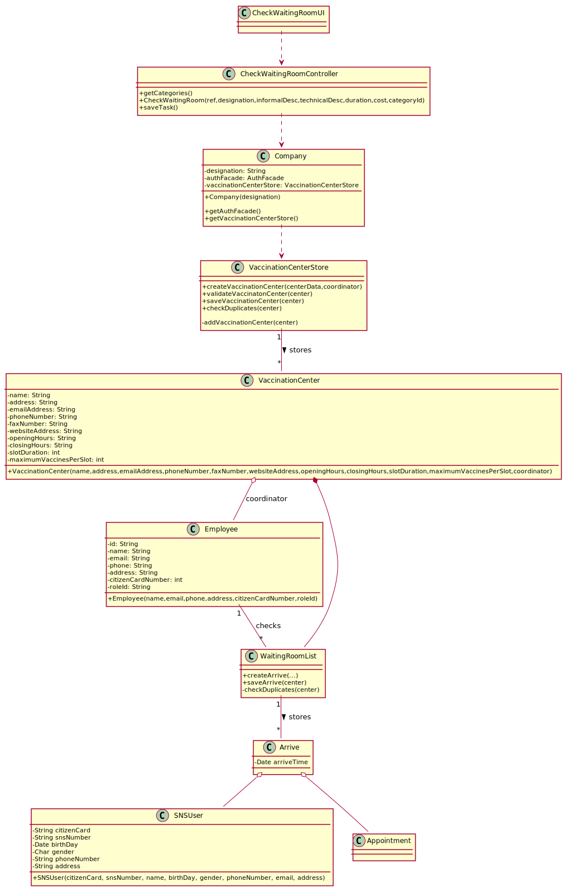

# US 005 - To create a Task

## 1. Requirements Engineering

### 1.1. User Story Description

As a nurse, I intend to consult the users in the waiting room of a vaccination center.

### 1.2. Customer Specifications and Clarifications

**From the specifications document:**

> "[...] the receptionist should send the SNS user to a waiting room where (s)he should wait for his/her time."

> "At any time, a nurse responsible for administering the vaccine will use the application to check the list of SNS users that are present in the vaccination center to take the vaccine"

**From the client clarifications:**

> **Question:** "[...] what does consulting constitute in this context? [...]"
>
> **Answer:** "[...] is to check the list of users that are waiting and ready to take the vaccine."

> **Question:** "[...] the nurse have to chose the vaccination center before executing the list [...] ?"
>
> **Answer:** "When the nurse starts to use the application, firstly, the nurse should select the vaccination center where she his working. The nurse wants to check the list of SNS users that are waiting in the vaccination center where she his working."

> **Question:** "[...] which are the attributes of the waiting room"
>
> **Answer:** "The waiting room will not be registered or defined in the system. The waiting room of each vaccination center has the capacity to receive all users who take the vaccine on given slot."

> **Question:** "[...] the nurses and the receptionists will work at any center [...]?"
>
> **Answer:** "Nurses and receptionists can work in any vaccination center."

### 1.3. Acceptance Criteria

- **AC1:** SNS Users’ list should be presented by order of arrival.

### 1.4. Found out Dependencies

- There is a dependency to "US04 Register SNS User Arrival" since the list of SNS Users present in the waiting room is needed to be consulted.

### 1.5 Input and Output Data

**Input Data:**

- Selected data:
  - Vaccination Center

**Output Data:**

- List of users present in the waiting room
- (In)Success of the operation

### 1.6. System Sequence Diagram (SSD)

**Alternative 1**

**Other alternatives might exist.**

### 1.7 Other Relevant Remarks

- The nurse selects the vaccination center he/she is working on after logging in.

## 2. OO Analysis

### 2.1. Relevant Domain Model Excerpt

### 2.2. Other Remarks

Not found.

## 3. Design - User Story Realization

### 3.1. Rationale

**SSD - Alternative 1 is adopted.**

| Interaction ID | Question: Which class is responsible for...            | Answer               | Justification (with patterns)                                                                                 |
| :------------- | :----------------------------------------------------- | :------------------- | :------------------------------------------------------------------------------------------------------------ |
| Step 1         | ... interacting with the actor?                        | CreateTaskUI         | Pure Fabrication: there is no reason to assign this responsibility to any existing class in the Domain Model. |
|                | ... coordinating the US?                               | CreateTaskController | Controller                                                                                                    |
|                | ... instantiating a new Task?                          | Organization         | Creator (Rule 1): in the DM Organization has a Task.                                                          |
|                | ... knowing the user using the system?                 | UserSession          | IE: cf. A&A component documentation.                                                                          |
|                | ... knowing to which organization the user belongs to? | Platform             | IE: has registed all Organizations                                                                            |
|                |                                                        | Organization         | IE: knows/has its own Employees                                                                               |
|                |                                                        | Employee             | IE: knows its own data (e.g. email)                                                                           |
| Step 2         |                                                        |                      |                                                                                                               |
| Step 3         | ...saving the inputted data?                           | Task                 | IE: object created in step 1 has its own data.                                                                |
| Step 4         | ...knowing the task categories to show?                | Platform             | IE: Task Categories are defined by the Platform.                                                              |
| Step 5         | ... saving the selected category?                      | Task                 | IE: object created in step 1 is classified in one Category.                                                   |
| Step 6         |                                                        |                      |                                                                                                               |
| Step 7         | ... validating all data (local validation)?            | Task                 | IE: owns its data.                                                                                            |
|                | ... validating all data (global validation)?           | Organization         | IE: knows all its tasks.                                                                                      |
|                | ... saving the created task?                           | Organization         | IE: owns all its tasks.                                                                                       |
| Step 8         | ... informing operation success?                       | CreateTaskUI         | IE: is responsible for user interactions.                                                                     |

### Systematization

According to the taken rationale, the conceptual classes promoted to software classes are:

- Company
- VaccinationCenter
- VaccinationCenterStore
- Employee
- Appointment
- Arrive

Other software classes (i.e. Pure Fabrication) identified:

- CheckWaitingRoomUI
- CheckWaitingRoomController

## 3.2. Sequence Diagram (SD)

**Alternative 1**

## 3.3. Class Diagram (CD)

**From alternative 1**

# 4. Tests

**Test 1:** Check that it is not possible to create an instance of the Task class with null values.

    @Test(expected = IllegalArgumentException.class)
    	public void ensureNullIsNotAllowed() {
    	Task instance = new Task(null, null, null, null, null, null, null);
    }

**Test 2:** Check that it is not possible to create an instance of the Task class with a reference containing less than five chars - AC2.

    @Test(expected = IllegalArgumentException.class)
    	public void ensureReferenceMeetsAC2() {
    	Category cat = new Category(10, "Category 10");

    	Task instance = new Task("Ab1", "Task Description", "Informal Data", "Technical Data", 3, 3780, cat);
    }

_It is also recommended to organize this content by subsections._

# 5. Construction (Implementation)

## Class CreateTaskController

    	public boolean createTask(String ref, String designation, String informalDesc,
    		String technicalDesc, Integer duration, Double cost, Integer catId)() {

    		Category cat = this.platform.getCategoryById(catId);

    		Organization org;
    		// ... (omitted)

    		this.task = org.createTask(ref, designation, informalDesc, technicalDesc, duration, cost, cat);

    		return (this.task != null);
    	}

## Class Organization

    	public Task createTask(String ref, String designation, String informalDesc,
    		String technicalDesc, Integer duration, Double cost, Category cat)() {

    		Task task = new Task(ref, designation, informalDesc, technicalDesc, duration, cost, cat);
    		if (this.validateTask(task))
    			return task;
    		return null;
    	}

# 6. Integration and Demo

- A new option on the Nurse menu options was added.

# 7. Observations
