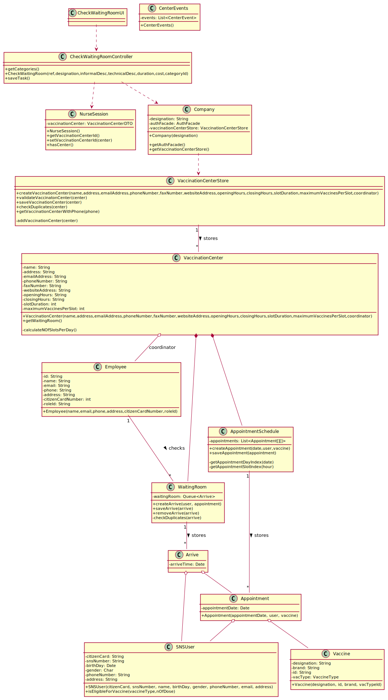

# US 005 - To create a Task

## 1. Requirements Engineering

### 1.1. User Story Description

As a nurse, I intend to consult the users in the waiting room of a vaccination center.

### 1.2. Customer Specifications and Clarifications

**From the specifications document:**

> "[...] the receptionist should send the SNS user to a waiting room where (s)he should wait for his/her time."

> "At any time, a nurse responsible for administering the vaccine will use the application to check the list of SNS users that are present in the vaccination center to take the vaccine"

**From the client clarifications:**
oov

> **Question:** "[...] what does consulting constitute in this context? [...]"
>
> **Answer:** "[...] is to check the list of users that are waiting and ready to take the vaccine."

> **Question:** "[...] the nurse have to chose the vaccination center before executing the list [...] ?"
>
> **Answer:** "When the nurse starts to use the application, firstly, the nurse should select the vaccination center where she his working. The nurse wants to check the list of SNS users that are waiting in the vaccination center where she his working."

> **Question:** "[...] which are the attributes of the waiting room"
>
> **Answer:** "The waiting room will not be registered or defined in the system. The waiting room of each vaccination center has the capacity to receive all users who take the vaccine on given slot."

> **Question:** "[...] the nurses and the receptionists will work at any center [...]?"
>
> **Answer:** "Nurses and receptionists can work in any vaccination center."

> **Question**: "What information about the Users (name, SNS number, etc) should the system display when listing them?"
>
> **Answer**: "Name, Sex, Birth Date, SNS User Number and Phone Number."

> **Question**: "Regarding US05, the listing is supposed to be for the day itself or for a specific day."
>
> **Answer**: "The list should show the users in the waiting room of a vaccination center."

> **Question**: "Is it supposed to remove a SNS user of the wait list when he leaves the waiting room to get the vaccine? If yes, how do we know when the sns user leaves the waiting room?"
>
> **Answer**: "US5 is only to list users that are in the waiting room of a vaccination centers."

### 1.3. Acceptance Criteria

- **AC1:** The nurse must be authenticated to and with a have selected a valid vaccination center
- **AC2:** SNS Users’ list should be presented by order of arrival.
- **AC3:** The fields to be shown must be: name, sex, birth date, SNS User Number and Phone Number.

### 1.4. Found out Dependencies

- There is a dependency to "US04 Register SNS User Arrival" since the list of SNS Users present in the waiting room is needed to be consulted.
- There is dependency with the implementation of the NurseSession, this component is needed to know the vaccination center the nurse is working on.

### 1.5 Input and Output Data

**Input Data:**

There is no input data.

**Output Data:**

- List of users present in the waiting room

### 1.6. System Sequence Diagram (SSD)

**Alternative 1**

**Other alternatives might exist.**

### 1.7 Other Relevant Remarks

- The nurse selects the vaccination center he/she is working on after logging in.

## 2. OO Analysis

### 2.1. Relevant Domain Model Excerpt

### 2.2. Other Remarks

Not found.

## 3. Design - User Story Realization

### 3.1. Rationale

**SSD - Alternative 1 is adopted.**

| Interaction ID                                                    | Question: Which class is responsible for...                 | Answer                         | Justification (with patterns)                                                                                                                                                                             |
| :---------------------------------------------------------------- | :---------------------------------------------------------- | :----------------------------- | :-------------------------------------------------------------------------------------------------------------------------------------------------------------------------------------------------------- | --- |
| asks to list users in waiting room for a given vaccination center | ... interacting with the nurse?                             | ListUsersInWaitingRoomUI       | Pure Fabrication: there is no reason to assign this responsibility to any existing class in the Domain Model.                                                                                             |
|                                                                   | ... coordinating the US?                                    | ListUsersWaitingRoomController | Controller: Has responsibility to delegate the UI events                                                                                                                                                  |
|                                                                   | ... knowing the vaccination center the nurse is working on? | NurseSession                   | Pure Fabrication/HC: Is not specified in the domain model but is needed to accomplish high cohesion. (Not let the task of informing the center the nurse is working on to SelectNurseVaccinationCenterUI) |
|                                                                   | ... getting the nurse vaccination center data?              | VaccinationCenterStore         | IE: knows all the existing vaccination centers                                                                                                                                                            |     |
|                                                                   | ... knowing the vaccination center waiting room?            | VaccinationCenter              | IE: knows it's attributes                                                                                                                                                                                 |
|                                                                   | ... knowing the users who have arrived?                     | WaitingRoom                    | IE: aggregates arrives                                                                                                                                                                                    |
|                                                                   | ... knowing the attributes to display?                      | ArriveDTO                      | DTO: has registered all Organizations                                                                                                                                                                     |
| lists all the users present on the waiting room                   | ... display the list to the user?                           | CreateTaskUI                   | IE: is responsible for user interactions.                                                                                                                                                                 |

### Systematization

According to the taken rationale, the conceptual classes promoted to software classes are:

- Company
- VaccinationCenter
- VaccinationCenterStore
- VaccinationCenterListDTO
- WaitingRoom
- Arrive
- ArriveDTO
- NurseSession

Other software classes (i.e. Pure Fabrication) identified:

- CheckWaitingRoomUI
- CheckWaitingRoomController

## 3.2. Sequence Diagram (SD)

**Alternative 1**

## 3.3. Class Diagram (CD)

**From alternative 1**

# 4. Tests

**Test 1:** Check that it is not possible to create an instance of the Task class with null values.

    @Test(expected = IllegalArgumentException.class)
    	public void ensureNullIsNotAllowed() {
    	Task instance = new Task(null, null, null, null, null, null, null);
    }

**Test 2:** Check that it is not possible to create an instance of the Task class with a reference containing less than five chars - AC2.

    @Test(expected = IllegalArgumentException.class)
    	public void ensureReferenceMeetsAC2() {
    	Category cat = new Category(10, "Category 10");

    	Task instance = new Task("Ab1", "Task Description", "Informal Data", "Technical Data", 3, 3780, cat);
    }

# 5. Construction (Implementation)

## Class ListUsersWaitingRoomController

    public ListUsersWaitingRoomController(Company company, EmployeeSession nurseSession) throws NotAuthorizedException {
      if (!nurseSession.hasCenter()) throw new NotAuthorizedException("Nurse is not logged in");
      this.nurseSession = nurseSession;
      this.vaccinationCenterStore = company.getVaccinationCenterStore();
    }

## Class WaitingRoom

    public class WaitingRoom implements Iterable<Arrival> {
        Queue<Arrival> waitingRoom;

        public WaitingRoom() {
          this.waitingRoom = new LinkedList<Arrival>();
        }

        @Override
        public Iterator<Arrival> iterator() {
          return waitingRoom.iterator();
        }
    }

# 6. Integration and Demo

- A new option on the Nurse menu options was added.

# 7. Observations

**Nurse select center SD**

