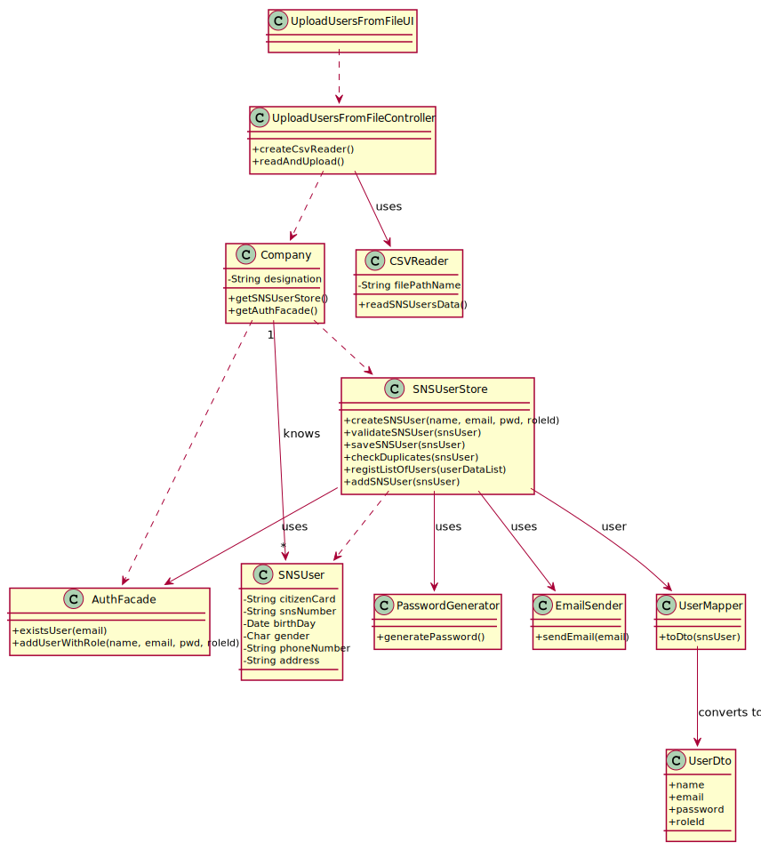

# US 14 - Load users from a file

## 1. Requirements Engineering

### 1.1. User Story Description

As an administrator, I want to load a set of users from a CSV file.

### 1.2. Customer Specifications and Clarifications 

**From the specifications document:**

> A SNS User is a person who is registered in the system.

> A SNS User must have an email, a password, a name, a birthday as well as a SNS number.

> Any Administrator uses the application to register SNS users.

**From the client clarifications:**

> **Question:** What would be the sequence of parameters to be read on the CSV?
>  
> **Answer:** Name, Sex, Birth Date, Address, Phone Number, E-mail, SNS User Number and Citizen Card Number.
>
> **Question:** "is there any specific format that should be validated for the address, or we can assume it is just of string type?"
>
> **Answer:** The address contained in the CSV file is a string and should not contain commas or semicolons.
>
> **Question:** "how should the admin receive the login data/passwords for all registered users?"
>
> **Answer:** During this sprint, login and password data should be presented in the console application.
In US14 the application is used to register a batch of users. For each user, all the data required to register a user should be presented in the console.

### 1.3. Acceptance Criteria

* **AC1:** The application must support importing two types of CSV
files: a) one type must have a header, column separation is done using “;”
character; b) the other type does not have a header, column separation is done
using “,” character. 
* **AC2:** The file path name field must filled in.
* **AC3:** The file path name must correspond to an existing and valid CSV file.
* **AC4:** When loading a User with an already existing reference, the system must reject such operation.
* **AC5:** Birth day must have the format: DD/MM/YYYY. A SNS User should not have more than 150 years of age.
* **AC6:** Citizen card numbers should follow the portuguese format (8 digits, 1 control digit and 2 chars + 1 digit)
* **AC7:** SNS number must have 9 digits.
* **AC8:** Phone numbers should follow the portuguese format ("+351" + 9 digits).
* **AC9:** Email address must be validated using a regular expression.
* **AC10:** Gender options: Male, Female or n/a.
* **AC11:** The password should be randomly generated. It should have 7 alphanumeric characters, 3 of them being upper case and 2 of them must be digits.
* **AC12:** All input fields are required except gender.
* **AC13:** The email, phone number, citizen card number and SNS User number must be unique for each SNS User.

### 1.4. Found out Dependencies

* No dependencies were found.

### 1.5 Input and Output Data

**Input Data:**

* Typed data:
	* File path name

**Output Data:**

* Registered Users Information

### 1.6. System Sequence Diagram (SSD)

**Alternative 1**

**Other alternatives might exist.**

### 1.7 Other Relevant Remarks

n/a

## 2. OO Analysis

### 2.1. Relevant Domain Model Excerpt 

### 2.2. Other Remarks

n/a

## 3. Design - User Story Realization 

### 3.1. Rationale

**SSD - Alternative 1 is adopted.**

| Interaction ID | Question: Which class is responsible for... | Answer  | Justification (with patterns)  |
|:-------------  |:--------------------- |:------------|:---------------------------- |
| Step 1  		 |	... interacting with the actor? | UploadUsersFromFileUI   |  Pure Fabrication: there is no reason to assign this responsibility to any existing class in the Domain Model.           |
| 			  	 |	... coordinating the US? | UploadUsersFromFileController | Controller                             |
| Step 2  		 |							 |             |                              |
| Step 3  		 |	...saving the inputted data? | CSVReader  | IE: owns the data.  |
|  		 |	...validate CSV path? | CSVReader  | IE: owns the data.  |
| Step 4  		 |							 |             |                              |
| Step 5  		 |	...read the file? | ICSVReader  | Protected Variation: There are more than 1 variation of file types. |
| 		 |	...store user data? | SNSUserDto  | DTO: stores user data.  |
| 		 |	...convert string of user data to SNSUserDTO? | SNSUserMapper  | IE: can convert user data to DTO.  |  
| 		 |	...instantiating SNSUserDTO? | SNSUserStore  | Creator: SNSUserStore needs a SNSUserDTO to create SNSUser.  |  		 
| 		 |	...instantiating SNSUser? | SNSUserStore  | Creator: SNSUserStore has a SNSUser.  |  		 
|  		 |	...validating SNSUser data?(locally) | SNSUser  | IE: owns the data.  |
|  		 |	...validating SNSUser data?(globally) | SNSUserStore  | IE: knows every SNSUsers registered.  |
| 		 |	...know the method to generate password? | PasswordGeneratorFactory  | Factory: knows the logic to generate password.  |  
| 		 |	...generate password? | IPasswordGenerator  | IE: knows how to generate password.  |  		 
|  		 |	...saving created SNSUser? | SNSUserStore  | IE: owns every SNSUsers.  |
|  		 |	...store the information to notify the user? | SNSUserNotificationDTO  | DTO: store information to notify user.  |
|  		 |	...convert snsUser to notificationDTO? | SNSUserNotificationMapper  | DTO: knows relevant data for notificationDTO.  |
|  		 |	...know the method to notify user? | SenderFactory  | Factory: knows the logic to notify user.  |
|  		 |	...notify user? | ISender  | IE: knows how to notify user.  |
|  		 |	...add the user to the system? | authFacade  | IE: owns every Users.  |
| Step 6  		 |	... informing operation success?| UploadUserFromFileUI  | IE: is responsible for user interactions.  |

### Systematization ##

According to the taken rationale, the conceptual classes promoted to software classes are: 

 * Company
 * App
 * SNSUserStore
 * SNSUser
 * CSVReader
 * ICSVReader
 * SNSUserDto
 * SNSUserMapper
 * SNSUserNotificationDTO
 * SNSUserNotificationMapper
 * IPasswordGenerator
 * AuthFacade
 * ISender
 * SenderFactory

Other software classes (i.e. Pure Fabrication) identified: 

 * UploadUsersFromFileUI	  
 * UploadUsersFromFileController

## 3.2. Sequence Diagram (SD)

**Alternative 1**

## 3.3. Class Diagram (CD)

**From alternative 1**

# 4. Tests 

**Test 1:** Check that it is not possible to create an instance of the Task class with null values. 

	@Test(expected = IllegalArgumentException.class)
		public void ensureNullIsNotAllowed() {
		Task instance = new Task(null, null, null, null, null, null, null);
	}
	

**Test 2:** Check that it is not possible to create an instance of the Task class with a reference containing less than five chars - AC2. 

	@Test(expected = IllegalArgumentException.class)
		public void ensureReferenceMeetsAC2() {
		Category cat = new Category(10, "Category 10");
		
		Task instance = new Task("Ab1", "Task Description", "Informal Data", "Technical Data", 3, 3780, cat);
	}

*It is also recommended to organize this content by subsections.* 

# 5. Construction (Implementation)

## Class CreateTaskController 

		public boolean createTask(String ref, String designation, String informalDesc, 
			String technicalDesc, Integer duration, Double cost, Integer catId)() {
		
			Category cat = this.platform.getCategoryById(catId);
			
			Organization org;
			// ... (omitted)
			
			this.task = org.createTask(ref, designation, informalDesc, technicalDesc, duration, cost, cat);
			
			return (this.task != null);
		}

## Class Organization

		public Task createTask(String ref, String designation, String informalDesc, 
			String technicalDesc, Integer duration, Double cost, Category cat)() {
		
	
			Task task = new Task(ref, designation, informalDesc, technicalDesc, duration, cost, cat);
			if (this.validateTask(task))
				return task;
			return null;
		}

# 6. Integration and Demo 

* A new option on the Employee menu options was added.

* Some demo purposes some tasks are bootstrapped while system starts.

# 7. Observations

Platform and Organization classes are getting too many responsibilities due to IE pattern and, therefore, they are becoming huge and harder to maintain. 

Is there any way to avoid this to happen?

