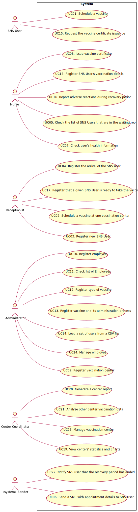

# Use Case Diagram (UCD)

# Use Cases / User Stories

| UC/US | Description                                                         |
| :---- | :------------------------------------------------------------------ |
| US 01 | [ScheduleVaccineAsSNSUser](US01/US01_ScheduleVaccine.md)            |
| US 02 | [ScheduleVaccineAsReceptionist](US02/US02_ScheduleVaccination.md)   |
| US 03 | [RegisterSNSUser](US03/US03_RegisterSNSUser.md)                     |
| US 04 | [RegisterSNSUserArrival](US04/US04_RegisterSNSUserArrival.md)       |
| US 05 | [CheckWaitingRoom](US05/US05_CheckWaitingRoom.md)                   |
| US 09 | [RegisterVaccinationCenter](US09/US09_RegisterVaccinationCenter.md) |
| US 10 | [RegisterEmployee](US10/US10_RegisterEmployee.md)                   |
| US 11 | [GetEmployeesByRole](US11/US11_GetEmployeesListByRole.md)           |
| US 12 | [SpecifyNewVaccineType](US12/US12_SpecifyNewVaccineType.md)         |
| US 13 | [SpecifyNewVaccine](US13/US13_SpecifyNewVaccine.md)                 |
| US 14 | [LoadUsersFromCSV](US14/US14_LoadUsersFromCSVFile.md)               |
