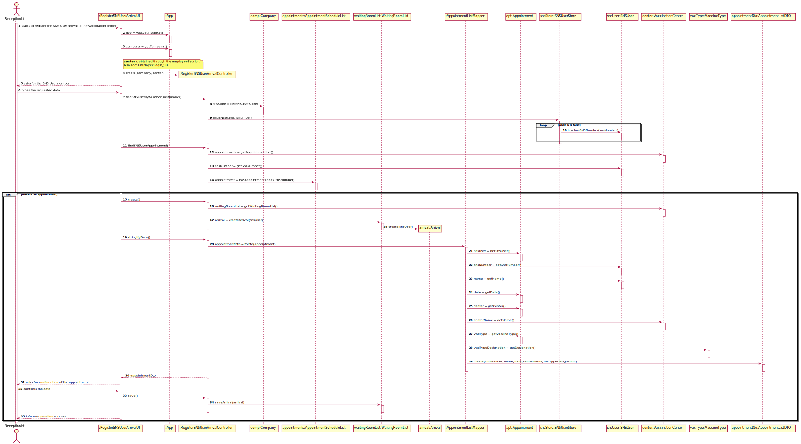
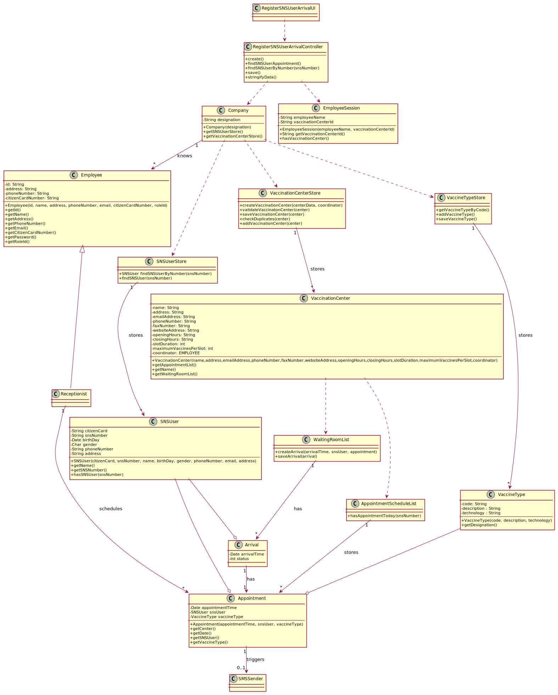

# US 04 - Register SNS User Arrival

## 1. Requirements Engineering

### 1.1. User Story Description

_"As a receptionist at a vaccination center, I want to register the arrival of a SNS user to take the vaccine."_

### 1.2. Customer Specifications and Clarifications

**From the specifications document:**

> When the SNS user arrives at the vaccination center, a receptionist registers the arrival of the user to take the respective vaccine.

> The receptionist asks the SNS user for his/her SNS user number and confirms that he/she has the vaccine scheduled for the that day and time.
> If the information is correct, the receptionist acknowledges the system that the user is ready to take the vaccine.
> Then, the receptionist should send the SNS user to a waiting room where (s)he should wait for his/her time.

**From the client clarifications:**

> **Question:** In this user story, the receptionist registers the arrival of an SNS User. Does the receptionist choose the center she works at during login like the nurse?
>
> **Answer:** To start using the application, the receptionist should first select the vaccination center where she is working. The receptionists register the arrival of a SNS user at the vaccination center where she is working.

> **Question:** Regarding US04, what are the attributes needed in order to register the arrival of a SNS user to a vaccination center?
>
> **Answer:** The time of arrival should be registered.

> **Question:** Regarding US04, should the attribute "arrival time" be considered the moment the user enters the waiting room?
> For example, a user that arrives 40 minutes after his appointment won't be allowed to enter the center, and another who only arrives 10 minutes late may proceed. If so, how much compensation time should we provide to the user?
>
> **Answer:** In this sprint we are not going to address the problem of delays. All arriving users are attended and registered by the receptionist.

> **Question:** Regarding US04, should the receptionist register the arrival of a SNS user immediately when he arrives at the vaccination center or only after the receptionist confirms that the respective user has a vaccine scheduled for that day and time?
>
> **Answer:** The receptionist registers the arrival of a SNS user only after confirming that the user has a vaccine scheduled for that day and time.

> **Question:** When the SNS user number is introduce by the receptionist and the system has no appointment for that SNS user number, how should the system proceed?
>
> **Answer:** The application should present a message saying that the SNS user did not scheduled a vaccination.

### 1.3. Acceptance Criteria

-   **AC1:** No duplicate entries should be possible for the same SNS user on the same day or vaccine period.

### 1.4. Found out Dependencies

-   There is a dependency to "US03 Receptionist registers a SNS User" since at least one SNS User must exist to be able to check the appointments and register arrivals.
-   There is dependency with the implementation of the EmployeeSession, this component is needed to know the vaccination center the receptionist is working on.

### 1.5 Input and Output Data

**Input Data:**

-   Typed data:

    -   the SNS Users' number

-   Selected data:
    -   the vaccination center the receptionist is working on

**Output Data:**

-   Appointment confirmation
-   (In)Success of the operation

### 1.6. System Sequence Diagram (SSD)

**Alternative 1**

<!-- **Other alternatives might exist.** -->

### 1.7 Other Relevant Remarks

-   The arrival is only created after confirmation that the given SNS User has an appointment for that day.

## 2. OO Analysis

### 2.1. Relevant Domain Model Excerpt

### 2.2. Other Remarks

n/a

## 3. Design - User Story Realization

### 3.1. Rationale

**SSD - Alternative 1 is adopted.**

| Interaction ID                                                    | Question: Which class is responsible for...                        | Answer                           | Justification (with patterns)                                                                                 |
| :---------------------------------------------------------------- | :----------------------------------------------------------------- | :------------------------------- | :------------------------------------------------------------------------------------------------------------ |
| starts to register the SNS User arrival to the vaccination center | ... interacting with the receptionist?                             | RegisterSNSUserArrivalUI         | Pure Fabrication: there is no reason to assign this responsibility to any existing class in the Domain Model. |
|                                                                   | ... coordinating the US?                                           | RegisterSNSUserArrivalController | Controller                                                                                                    |
|                                                                   | ... instantiating a new Task?                                      | Organization                     | Creator (Rule 1): in the DM Organization has a Task.                                                          |
|                                                                   | ... knowing the vaccination center the receptionist is working on? | EmployeeSession                  | Pure Fabrication: Is not specified in the domain model but is needed to accomplish low coupling.              |
|                                                                   | ... getting the nurse vaccination center data?                     | VaccinationCenterStore           | IE: knows all the vaccination centers                                                                         |
| types the SNS User number                                         |                                                                    |                                  |                                                                                                               |
|                                                                   | ... knowing the SNS Users existent?                                | Company                          | IE: knows all their SNS Users                                                                                 |
|                                                                   | ... knowing the vaccination center appointment list?               | VaccinationCenter                | IE: has its appointmentss                                                                                     |
|                                                                   | ... validating all data (local validation)?                        | AppointmentScheduleList          | IE: knows all its appointments.                                                                               |
|                                                                   | ... knowing the vaccination center waiting room?                   | VaccinationCenter                | IE: has its waiting room                                                                                      |
|                                                                   | ... knowing the properties of the arrival to show?                 | AppointmentListDTO               | DTO: filters the properties to be shown for confirmation                                                      |
| confirms the appointment                                          |                                                                    |                                  |                                                                                                               |
|                                                                   | ... saving the created arrival?                                    | Organization                     | IE: owns all its tasks.                                                                                       |
| informs operation success                                         | ... informing operation success?                                   | RegisterSNSUserArrivalUI         | IE: is responsible for user interactions.                                                                     |

### Systematization

According to the taken rationale, the conceptual classes promoted to software classes are:

-   Appointment
-   AppointmentDTO
-   Arrival
-   Company
-   EmployeeSession
-   VaccinationCenter
-   VaccinationCenterStore
-   WaitingRoom
-   WaitingRoomList

Other software classes (i.e. Pure Fabrication) identified:

-   RegisterSNSUserArrivalUI
-   RegisterSNSUserArrivalController

## 3.2. Sequence Diagram (SD)

**Alternative 1**

## 3.3. Class Diagram (CD)

**From alternative 1**

# 4. Tests

**Test 1:** Check that an SNS User has already arrived today.

    @Test
    public void ensureHasSnsUserArrivedTodayIsWorking() {
    	Arrival arrival = waitingRoom.createArrival(appointment);

    	waitingRoom.saveArrival(arrival);
    	assertTrue(waitingRoom.hasSNSUserArrivedToday(appointment.getSnsUser()));
    }

**Test 2:** Check that duplicated arrivals are not allowed.

    @Test(expected = AppointmentNotFoundException.class)
    public void ensureSNSUserDoesntArriveTwice() throws AppointmentNotFoundException {
        this.createAppointment();
        ctrl.findSNSUser("123456789");
        ctrl.findSNSUserAppointment();
        ctrl.create();
        ctrl.save();
        ctrl.findSNSUserAppointment();
    }

**Test 3:** Check that the arrival returns the correct appointment.

    @Test
    public void ensureGetAppointmentWorksAsExpected() {
        SNSUser snsUser = this.snsUserStore.findSNSUserByNumber("123456789");
        Calendar date = Calendar.getInstance();
        date.set(Calendar.HOUR_OF_DAY, 20);
        date.set(Calendar.MINUTE, 30);

        Appointment appointment = new Appointment(snsUser, date, center, this.vacType, true);
        Arrival arrival = new Arrival(appointment);

        assertEquals(arrival.getAppointment(), appointment);
    }

**Test 4:** Check that it is not possible to create an instance of the Task class with null values.

    @Test
    public void ensureHasVaccineTypeWorks() {
        SNSUser snsUser = this.snsUserStore.findSNSUserByNumber("123456789");
        Calendar date = Calendar.getInstance();
        date.set(Calendar.HOUR_OF_DAY, 20);
        date.set(Calendar.MINUTE, 30);

        Appointment appointment = new Appointment(snsUser, date, center, this.vacType, true);

        assertEquals(true, appointment.hasVaccineType(this.vacType));
        assertEquals(false, appointment.hasVaccineType(null));
    }

<!-- _It is also recommended to organize this content by subsections._ -->

# 5. Construction (Implementation)

## Class RegisterSNSUserArrivalController

    	public RegisterSNSUserArrivalController(Company company, VaccinationCenter center) {
    		this.company = company;
    		this.center = center;
    	}

## Class Organization

    	public Arrival createArrival(Appointment appointment) {
    		return new Arrival(appointment);
    	}

# 6. Integration and Demo

-   A new Arrival is created.
-   This Arrival will appear in the Waiting Room List, checked by the nurse.

# 7. Observations

The receptionist selects the vaccination center she is currently working on at login time.

