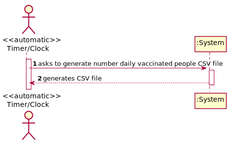
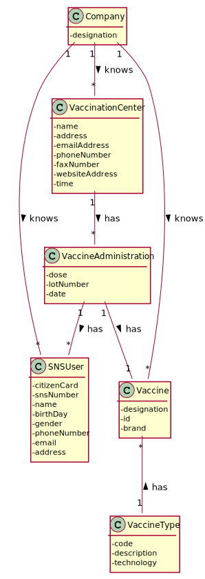
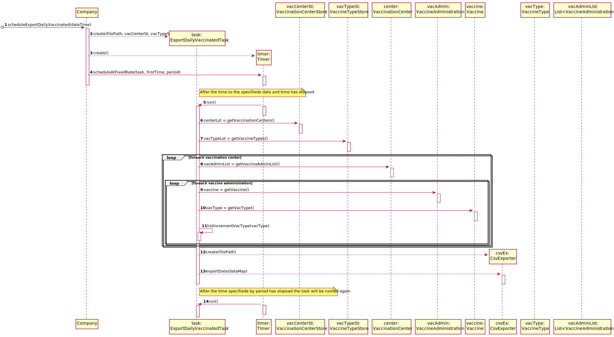
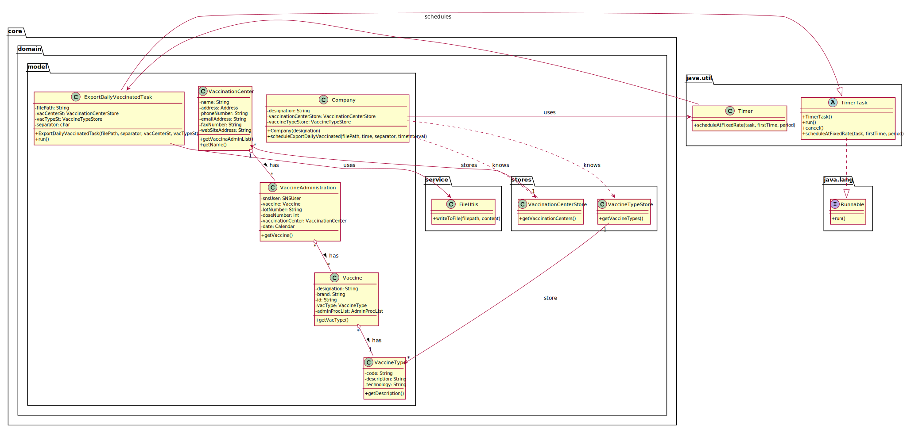

# US 06 - Record Daily Vaccinated

## 1. Requirements Engineering

### 1.1. User Story Description

DGS wants to record daily the total number of people vaccinated in each vaccinated center.

### 1.2. Customer Specifications and Clarifications

**From the specifications document:**

> No Information regarding this US was found on the specifications document.

**From the client clarifications:**

> **Question:** In the acceptance criteria, "the algorithm should run automatically at a time defined in a configuration file and should register a date, the name of the vaccination center and the total number of vaccinated users." How it is supposed to register this information? Should it be recorded in a file (ex: txt,..) or recorded in the system (ex: in a store) ?
>  
> **Answer:** The data should be written to a CSV file (field delimiter should be a semicolon).

### 1.3. Acceptance Criteria

* **AC1** The algorithm should run automatically at a time defined in a configuration file and should register the date, the name of the vaccination center and the total number of vaccinated users.
  
### 1.4. Found out Dependencies

* There is a dependency to US08 - "As a nurse, I want to record the administration of a vaccine to a SNS user. At the end of the recovery period, the user should receive a SMS message informing the SNS user that he can leave the vaccination center.", because in order to record the daily vaccinated people, its needed that the vaccine administration get registered in the system.
  
### 1.5 Input and Output Data

**Output Data:**

- A CSV file is generated

### 1.6. System Sequence Diagram (SSD)

### 1.7 Other Relevant Remarks

## 2. OO Analysis

### 2.1. Relevant Domain Model Excerpt

## 3. Design - User Story Realization

### 3.1. Rationale

| Interaction ID | Question: Which class is responsible for... | Answer | Justification (with patterns) |
| :------------- | :------------------------------------------ | :----- | :---------------------------- |
| Step 1 | ... instantiating ExportDailyVaccinatedTask? | Company | Creator |
|  | ... instantiating Timer? | Company | Creator |
|  | ... scheduling task operation? | Company | IE: knows necessary data for scheduling |
|  | ... call task at time specified? | Timer | Pure Fabrication |
|  | ... export daily vaccinated? | ExportDailyVaccinatedTask | IE: knows data necessary to do it |
|  | ... get list of vaccination centers? | VaccinationCenterStore | IE/HC/LC: knows all vaccine centers |
|  | ... get list of vaccine types? | VaccineTypeStore | IE/HC/LC: knows all vaccine types |
|  | ... get list of yesterday's vaccine administrations? | VaccinationCenter | IE: knows vaccine administration from center |
|  | ... get the vaccine administered? | VaccineAdministration | IE: knows which vaccine was administered |
|  | ...  get the vaccine type of the vaccine administered? | Vaccine | IE: has a vaccine type |
|  | ...  get the description of the vaccine type? | VaccineType | IE: has a description |
|  | ...  get the vaccine name? | Vaccine | IE: has a name |
|  | ... create and write data to file? | FileUtils | IE: knows how write in files |

### Systematization

According to the taken rationale, the conceptual classes promoted to software classes are:

- Company
- VaccinationCenterStore
- VaccineTypeStore
- VaccinationCenter
- VaccineType
- Vaccine
- VaccineAdministration
- ExportDailyVaccinatedTask
- FileUtils

Other software classes (i.e. Pure Fabrication) identified:
- Timer

## 3.2. Sequence Diagram (SD)

## 3.3. Class Diagram (CD)

# 4. Tests

**VACCINATION CENTER TESTS**

**Test 1:** Check that if there are not any vaccine administration registered getVacAdminFromYesterdayList returns an empty list

    @Test
    public void ensureEmptyListWorks() {
        VaccinationCenter center = new HealthCareCenter("Centro Vacinação Porto", new Address("street", 1, "11-11", "city"), "vacinacaoporto@gmail.com",
            "+351912345678", "+351223456799", "https://www.centrovacinaoporto.com", openingHours, closingHours, slot, this.coordinator, "a", "a");
        List<VaccineAdministration> emptyList = new ArrayList<>();

        assertEquals(emptyList, center.getVacAdminFromYesterdayList());
    }

**VACCINATION CENTER TESTS**

**Test 1:** Check that if there are not any vaccine administration exportation works

# 5. Construction (Implementation)

_In this section, it is suggested to provide, if necessary, some evidence that thye construction/implementation is in accordance with the previously carried out design. Furthermore, it is recommeded to mention/describe the existence of other relevant (e.g. configuration) files and highlight relevant commits._

_It is also recommended to organize this content by subsections._

# 6. Integration and Demo

# 7. Observations

The properties defined in the Sequence Diagram can be changed by the administrator.
