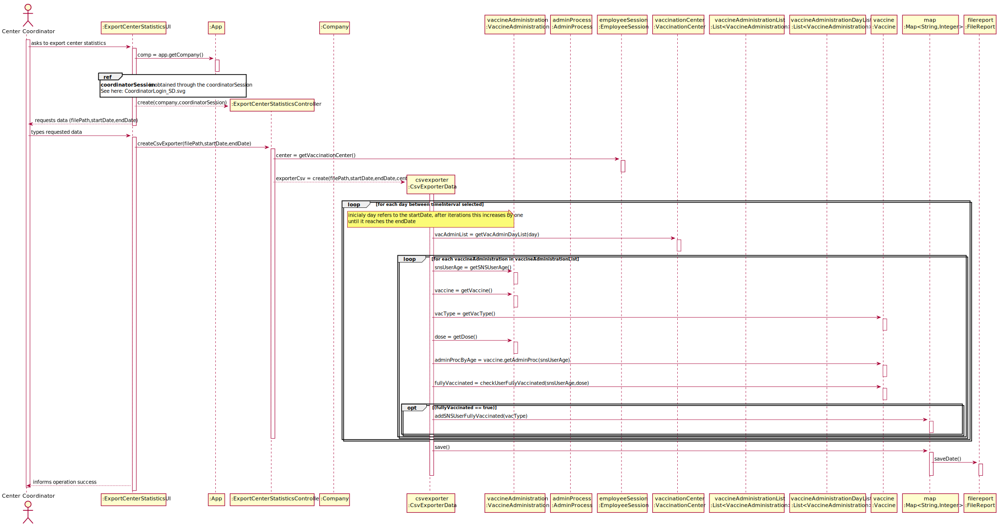

# US 15 - Check and export vaccination statistic.

## 1. Requirements Engineering

### 1.1. User Story Description

As a center coordinator, I intend to check and export vaccination statistic. I want to export, to a csv file, the total number of fully vaccinated users per day.

### 1.2. Customer Specifications and Clarifications

**From the specifications document:**

> "The Center Coordinator wants to monitor the vaccination process, to see statistics and charts, to evaluate the performance of the vaccination process generate reports and analyze data (...)"

> "(...) each vaccination center has one coordinator."

**From the client clarifications:**

> **Question:** "In this US should the Center Coordinator check and export the Vaccination Statistics of the Center where he/she works at or should just check and export the Vaccination Statistics of all centers?"
>
> **Answer:** "The center coordinator can only export statistics from the vaccination center that he coordinates." (https://moodle.isep.ipp.pt/mod/forum/discuss.php?d=16830#p21602)

> **Question:** "Should the user introduce the name of the file intended to export the vaccination statistics?"
>
> **Answer:** "The user should introduce the name of the file." (https://moodle.isep.ipp.pt/mod/forum/discuss.php?d=16812#p21601)

> **Question:** "Are the vaccination statistics referring only to the fully vaccinated users or referring to something more ?"
>
> **Answer:** "Only to fully vaccinated users." (https://moodle.isep.ipp.pt/mod/forum/discuss.php?d=16812#p21601)

> **Question:** "When exporting vaccination statistics,do we export the data from all days available in the system or does the center coordinator chooses the time interval?" 
>
> **Answer:** "The user should define a time interval (two dates)." (https://moodle.isep.ipp.pt/mod/forum/discuss.php?d=16799#p21598)

> **Question** "Is there any kind of format our exported data should follow?"
>
> **Answer:** "Data format: date; number of fully vaccinated user." (https://moodle.isep.ipp.pt/mod/forum/discuss.php?d=16799#p21598)

> **Question:** "Is the exportation of the CSV file that contains the total number of fully vaccinated users per day, the only feature that needs to be implemented in code, for US15?"
>
> **Answer:** "Yes." (https://moodle.isep.ipp.pt/mod/forum/discuss.php?d=16801#p21599)

### 1.3. Acceptance Criteria

* **AC1:** Output data should follow (date; number of fully vaccinated user).
* **AC2:** The user should define a time interval (two dates). Should follow the the portuguese format (dd/mm/yyyy).
* **AC3:** File name must be filled in.
* **AC4:** All required fields must be filled in.

### 1.4. Found out Dependencies

* There is a dependency to "US03 - Register SNS User" since at leat one sns user needs to be registered in the system.
* There is a dependency to "US08 - Record Administration of Vaccine" since at least one vaccine needs to be administered to a sns user.
* There is a dependency to "US09 - Register a Vaccination Center" since at least one vaccination center needs to be registered in the system.
* There is a dependency to "US12 - Register a new Vaccine Type" since at least one vaccine type needs to be registered in the system.
* There is a dependency to "US13 - Register a new Vaccine" since at least one vaccine needs to be registered in the system.

### 1.5 Input and Output Data

**Input Data:**

* Typed data:
	* File name,
	* Start date,
	* End date.

**Output Data:**

* Center Statistics
* Registered statistics of a center into a CSV file between two dates.
* Operation (in)success.

### 1.6. System Sequence Diagram (SSD)

### 1.7 Other Relevant Remarks

n/a.

## 2. OO Analysis

### 2.1. Relevant Domain Model Excerpt

### 2.2. Other Remarks

n/a.

## 3. Design - User Story Realization

### 3.1. Rationale

**SSD - Alternative 1 is adopted.**

| Interaction ID                                    | Question: Which class is responsible for... | Answer                     | Justification (with patterns)                                                                                 |
| :------------------------------------------------ | :------------------------------------------ | :------------------------- | :------------------------------------------------------------------------------------------------------------ |
| Step 1                                            | ... interacting with the actor?             | ExportStatisticsUI         | Pure Fabrication: there is no reason to assign this responsibility to any existing class in the Domain Model. |
|                                                   | ... coordinating the US?                    | ExportStatisticsController | Controller                                                                                                    |
| Step 2 requested data(fileName,startDate,endDate) | n/a                                         | n/a                        | n/a                                                                                                           |
| Step 3                                            | ... knows the coordinator center?           | EmployeeSession            | IE: holds information about the sessions of the users                                                         |
|                                                   | ... instantiating new FullyVaccinatedData?  | FullyVaccinatedData        | IE: holds the information relevant to the statistics                                                          |
|                                                   | ... holds information needed to statistics? | VaccineAdministration      | IE: holds information about the vaccination process of every user                                             |
|                                                   | ... check sns user is fully vaccinated?     | Vaccine                    | IE: holds information about the administrations process                                                       |
| Step 4                                            | ... saving the new statistics?              | FileUtils                  | Pure Fabrication: there is no reason to assign this responsibility to any existing class in the Domain Model. |
|                                                   | ... exports the data to a csv file?         | FileUtils                  | Pure Fabrication: there is no reason to assign this responsibility to any existing class in the Domain Model. |
|                                                   | ... shows coordinator statistics?           | ExportCenterStatisticsUI   | Pure Fabrication: there is no reason to assign this responsibility to any existing class in the Domain Model. |
### Systematization

According to the taken rationale, the conceptual classes promoted to software classes are:

- FullyVaccinatedData 
- VaccineAdministration
- Vaccine

Other software classes (i.e. Pure Fabrication) identified:

- ExportCenterStatisticsUI 
- ExportCenterStatisticsController
- EmployeeSession

## 3.2. Sequence Diagram (SD)

## 3.3. Class Diagram (CD)

# 4. Tests

**Test 1:** Check that it is not possible to create an instance of FullyVaccinatedData with invalid dates interval.

    @Test(expected = IllegalArgumentException.class)
    public void ensureGetFullyVaccinatedUsersPerDayMapWorksDoesNotAcceptInvalidInterval() {
        Calendar date1 = Calendar.getInstance();
        date1.add(Calendar.DAY_OF_MONTH, -2);

        Calendar date2 = Calendar.getInstance();
        date2.add(Calendar.DAY_OF_MONTH, -1);

        new FullyVaccinatedData("path", date2, date1, center1);
    }

# 5. Construction (Implementation)

### FullyVaccinatedData Constructor

	public FullyVaccinatedData(String path, Calendar start, Calendar end, VaccinationCenter center) {
        validatePath(path);
        validateDateInterval(start, end);
        validateCenter(center);

        this.startDate = start;
        this.endDate = end;
        this.center = center;
    }

# 6. Integration and Demo

* A new option on the Center Coordinator menu options was added (export statistics to a csv file).

# 7. Observations

