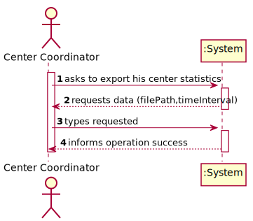
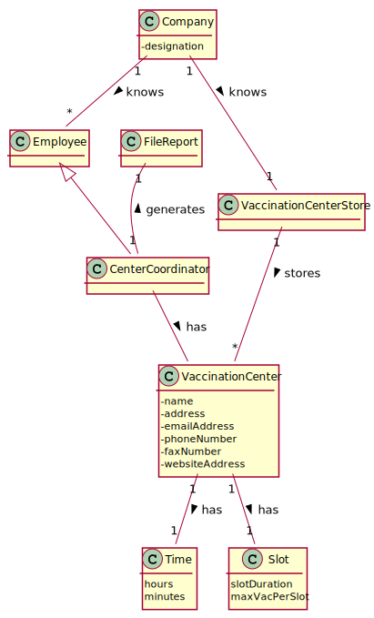
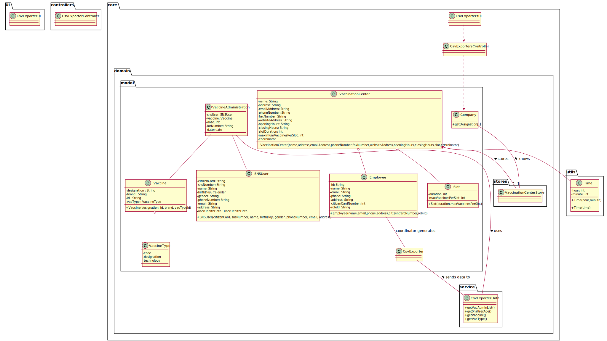

# US 15 - Check and export vaccination statistic.

## 1. Requirements Engineering

### 1.1. User Story Description

"As a center coordinator, I intend to check and export vaccination statistic. I want to export, to a csv file, the total number of fully vaccinated users per day."

### 1.2. Customer Specifications and Clarifications

"The Center Coordinator wants to monitor the vaccination process, to see statistics and charts, to evaluate the performance of the vaccination process generate reports and analyze data (... )"

### 1.3. Acceptance Criteria

n/a.

### 1.4. Found out Dependencies

* There is a dependency to "US03 - Register SNS User" since at leat one sns user needs to be registered in the system.
* There is a dependency to "US08 - Record Administration of Vaccine" since at least one vaccine needs to be administered to a sns user.
* There is a dependency to "US09 - Register a Vaccination Center" since at least one vaccination center needs to be registered in the system.
* There is a dependency to "US12 - Register a new Vaccine Type" since at least one vaccine type needs to be registered in the system.
* There is a dependency to "US13 - Register a new Vaccine" since at least one vaccine needs to be registered in the system.

### 1.5 Input and Output Data

**Input Data:**

* Typed data:
	* File path name

**Output Data:**

* Registered statistics of a center into a CSV file.
* Operation (in)success.

### 1.6. System Sequence Diagram (SSD)

### 1.7 Other Relevant Remarks

n/a.

## 2. OO Analysis

### 2.1. Relevant Domain Model Excerpt

### 2.2. Other Remarks

n/a.

## 3. Design - User Story Realization

### 3.1. Rationale

**The rationale grounds on the SSD interactions and the identified input/output data.**

| Interaction ID | Question: Which class is responsible for... | Answer                     | Justification (with patterns)                                                                                 |
| :------------- | :------------------------------------------ | :------------------------- | :------------------------------------------------------------------------------------------------------------ |
| Step 1         | ... interacting with the actor?             | ExportStatisticsUI         | Pure Fabrication: there is no reason to assign this responsibility to any existing class in the Domain Model. |
|                | ... coordinating the US?                    | ExportStatisticsController | Controller                                                                                                    |
| Step 2         | n/a                                         | n/a                        | n/a                                                                                                           |
| Step 3         | ... instantiating new ExporterCsvData?      | ExporterCsvData            | IE: holds the information relevant to the statistics                                                          |
|                | ... holds information needed to statistics? | VaccineAdministration      | IE: holds information about the vaccination process of every user                                             |
| Step 4         | ... saving the new statistics?              | ExporterCsvData            | IE:                                                                                                           |

### Systematization

According to the taken rationale, the conceptual classes promoted to software classes are:

- ExporterCsvData 
- VaccineAdministration

Other software classes (i.e. Pure Fabrication) identified:

- ExportStatisticsUI 
- ExportStatisticsController

## 3.2. Sequence Diagram (SD)

## 3.3. Class Diagram (CD)

# 4. Tests

_In this section, it is suggested to systematize how the tests were designed to allow a correct measurement of requirements fulfilling._

**_DO NOT COPY ALL DEVELOPED TESTS HERE_**

**Test 1:** Check that it is not possible to create an instance of the Example class with null values.

    @Test(expected = IllegalArgumentException.class)
    	public void ensureNullIsNotAllowed() {
    	Exemplo instance = new Exemplo(null, null);
    }

_It is also recommended to organize this content by subsections._

# 5. Construction (Implementation)

_In this section, it is suggested to provide, if necessary, some evidence that the construction/implementation is in accordance with the previously carried out design. Furthermore, it is recommeded to mention/describe the existence of other relevant (e.g. configuration) files and highlight relevant commits._

_It is also recommended to organize this content by subsections._

# 6. Integration and Demo

* A new option on the Center Coordinator menu options was added (export statistics to a csv file).

# 7. Observations

_In this section, it is suggested to present a critical perspective on the developed work, pointing, for example, to other alternatives and or future related work._
