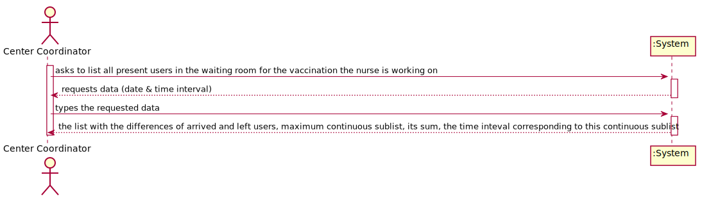
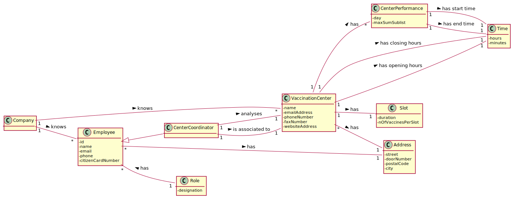
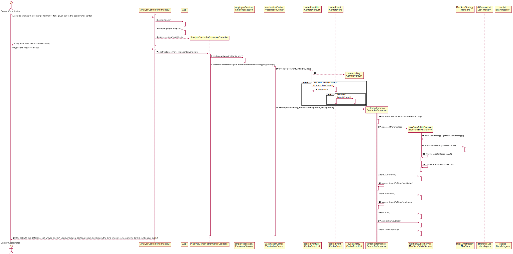
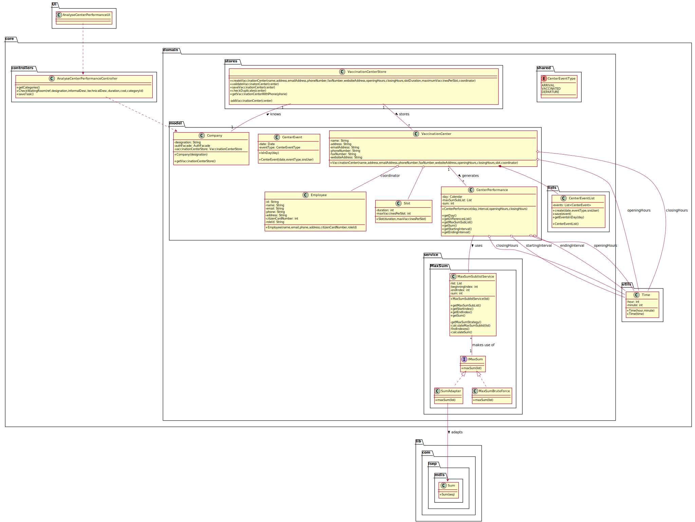

# US 16 - Analyse center performance

## 1. Requirements Engineering

### 1.1. User Story Description

As a center coordinator, I intend to analyse the performance of a center.

### 1.2. Customer Specifications and Clarifications

**From the specifications document:**

> "The Center Coordinator wants to monitor the vaccination process, [...], to evaluate the performance of the vaccination process"

> "The goal of the performance analysis is to decrease the number of clients in the center, from the moment they register at the arrival, until the moment they receive the SMS informing they can leave the vaccination center"

> "To evaluate this [...]: [...] for any time interval on one day, the difference between the number of new clients arrival and the number of clients leaving the center [...] is computed."

> "In the case of a working day, with a center open from 8 a.m. until 8 p.m., a list with 144 integers is obtained, where a positive integer means that in such a five-minute slot more clients arrive at the center for vaccination than clients leave with the vaccination process completed. A negative integer means the opposite."

> "The output should be the input list, the maximum sum contiguous sublist and its sum, and the time interval corresponding to this contiguous sublist"

> **From the client clarifications:**

> **Question:** "[...]"
>
> **Answer:** "[...]"

### 1.3. Acceptance Criteria

**AC1**: Time interval must be less than the total amount of minutes that a centers is open.

### 1.4. Found out Dependencies

There is a dependency found to US17 or US8. Only with one of those implemented there is enough data to analyse the performance of the center.

### 1.5 Input and Output Data

**Input Data:**

- Typed Data:
  - Date
  - Time Interval

**Output Data:**

- Input list
- Maximum sum contiguous sublist
- The sum of the maximum sum contiguous sublist
- The time interval corresponding to the maximum sum contiguous sublist

### 1.6. System Sequence Diagram (SSD)

### 1.7 Other Relevant Remarks

## 2. OO Analysis

### 2.1. Relevant Domain Model Excerpt

### 2.2. Other Remarks

## 3. Design - User Story Realization

### 3.1. Rationale

**The rationale grounds on the SSD interactions and the identified input/output data.**

| Interaction ID | Question: Which class is responsible for... | Answer | Justification (with patterns) |
| :------------- | :------------------------------------------ | :----- | :---------------------------- |
| Step 1         |                                             |        |                               |
| Step 2         |                                             |        |                               |
| Step 3         |                                             |        |                               |
| Step 4         |                                             |        |                               |
| Step 5         |                                             |        |                               |
| Step 6         |                                             |        |                               |
| Step 7         |                                             |        |                               |
| Step 8         |                                             |        |                               |
| Step 9         |                                             |        |                               |
| Step 10        |                                             |        |                               |

### Systematization

According to the taken rationale, the conceptual classes promoted to software classes are:

- Class1
- Class2
- Class3

Other software classes (i.e. Pure Fabrication) identified:

- xxxxUI
- xxxxController

## 3.2. Sequence Diagram (SD)

## 3.3. Class Diagram (CD)

# 4. Tests

**Test 1:** Check that it is not possible to create an instance of the Example class with null values.

    @Test(expected = IllegalArgumentException.class)
    	public void ensureNullIsNotAllowed() {
    	Exemplo instance = new Exemplo(null, null);
    }

# 5. Construction (Implementation)

_In this section, it is suggested to provide, if necessary, some evidence that the construction/implementation is in accordance with the previously carried out design. Furthermore, it is recommeded to mention/describe the existence of other relevant (e.g. configuration) files and highlight relevant commits._

_It is also recommended to organize this content by subsections._

# 6. Integration and Demo

_In this section, it is suggested to describe the efforts made to integrate this functionality with the other features of the system._

# 7. Observations

_In this section, it is suggested to present a critical perspective on the developed work, pointing, for example, to other alternatives and or future related work._
