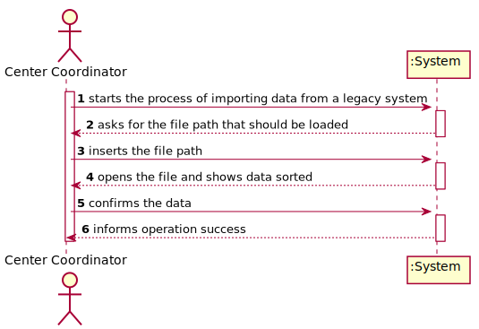
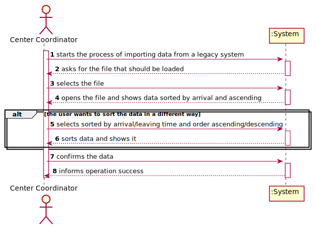
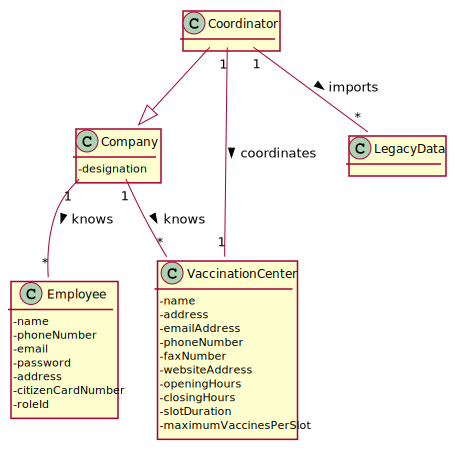
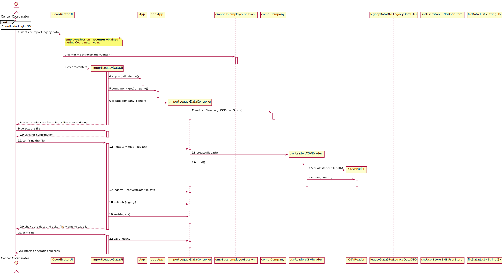
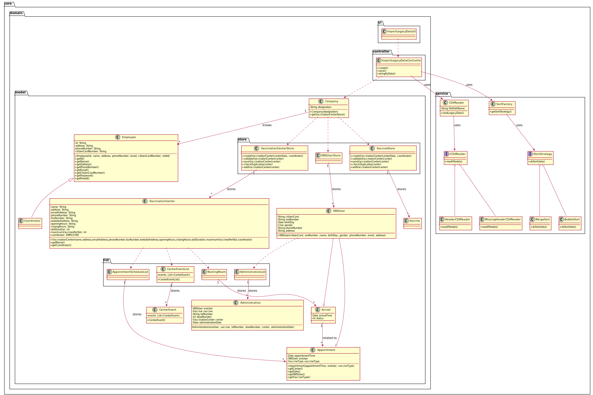
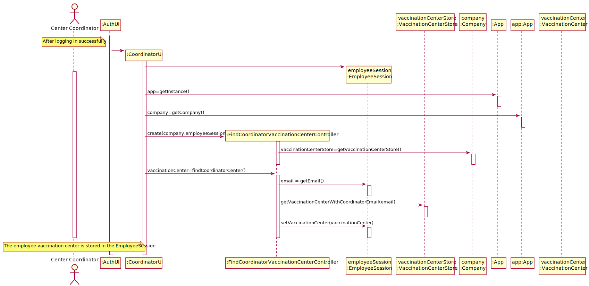

# US 17 - To import data from a legacy system

## 1. Requirements Engineering

### 1.1. User Story Description

_"As a center coordinator, I want to import data from a legacy system that was used in the past to manage centers. The imported data should be presented to the user sorted by arrival time or by the center leaving time. The name of the SNS user and the vaccine type **Short Description** should also be presented to the user."_

### 1.2. Customer Specifications and Clarifications

**From the specifications document:**

> The Center Coordinator wants to (...) generate reports and analyze data from other centers, including data from legacy systems.

**From the client clarifications:**

<!-- * The algorithm used to sort is defined in the properties. -->

> **Question:** "In the Sprint D requirements is stated that two sorting algorithms should be implemented and that the imported data should be sorted by arrival time or center leaving time. Should each algorithm be capable of both sortings or is one of the algorithms supposed to do one (e.g. arrival time) and the other the remaining sorting criteria (e.g. leaving time)?"
>
> **Answer:** "Each algorithm should be capable of doing both sortings. The application should be prepared to run both algorithms. The algorithm that will be used to sort data should be defined in a configuration file."

<!-- * The user chooses in the UI if he wants to sort by arrival or by departure time. -->

> **Question:** "Should there be an option to choose to either sort by arrival time or by the center leaving time?"
>
> **Answer:** "The user can choose to sort by arrival time or by the center leaving time."

<!--  -->

> **Question:** "I was analysing the csv file that should be imported for US17 (the one that is in moodle), I noticed that the date attributes are written like this 5/30/2022 I thought that the date format should be DD/MM/YYYY. I also noticed, that the time is written like this, 9:43, I also thought that the time format should be written like this HH:MM, (in this case it would be 09:43). Are the date and time formats diferent for US17?"
>
> **Answer:** "That file is from a legacy system, that uses a different date and time format. The date and time should be converted when loading the data into the application that we are developing."

<!--  -->

> **Question:** "I noticed that some postal codes in the address does not follow the format of XXXX-YYY. For example some of them are XXXX-Y. Are we supposed to be able to load those users as well?"
>
> **Answer:** "Yes."

<!--  -->

> **Question:** "In a meeting you already clarified that when uploading a file from a legacy system the application should check if the SNS Users are already registered and if not US 014 should be put to use. My question is now if only one or two SNS Users are not registered, should the whole legacy file be discarded?"
>
> **Answer:** "SNS users that are not registered should be loaded/registered. The other SNS users should not be registered again and should be ignored."

<!--  -->

> **Question:** "You already have clarified that when uploading a file from a legacy system the application should check if the SNS Users are already registered and if not, we should register them using US 014. How exactly do you want this to proceed, in case there aren't registered users, should the application ask the center coordinator to select the file with the users data to be uploaded?"
>
> **Answer:** "US14 and US17 are two different features of the system. In US17, if the SNS user does not exist in the system, the vaccination of this SNS user should not be loaded. The system should continue processing the CSV file until all vaccinations are processed."

<!--  -->

> **Question:** "Is there any correct format for the lot number? Should we simply assume that the lot number will always appear like this 21C16-05 ,like it's written in the file, and not validate it?"
>
> **Answer:** "The lot number has five alphanumeric characters an hyphen and two numerical characters (examples: 21C16-05 and A1C16-22)."

<!--  -->

> **Question:** "Should the vaccine named Spikevax, (the one in the given CSV file for US17), be registered before loading the CSV file?"
>
> **Answer:** "Yes."

<!-- * The user chooses ascending or descending order on UI. -->

> **Question:** "When sorting data by arrival time or central leaving time, should we sort from greater to smallest or from smallest to greater?"
>
> **Answer:** "The user must be able to sort in ascending and descending order."

<!--  -->

> **Question:** "Regarding the validation of the data in the performance data csv, in case the dose is the not the first one, should we check if the user age and the date when the user took the other vaccine dose, are valid for the new dose to be administered?"
>
> **Answer:** "The data from the legacy system (CSV file) should be validated before being loaded."

<!--  -->

> **Question:** "You answered to a previous question saying that the user should be able to sort by ascending or descending order. Should the user choose in the UI, the order in which the information should be presented? Or should this feature be defined in the configuration file?"
>
> **Answer:** "The center coordinator must use the GUI to select the sorting type (ascending or descending)."

<!--  -->

> **Question:** "Does the file loaded in US17 have only one day to analyse or can it have more than one day?"
>
> **Answer:** "The file can have data from more than one day."

### 1.3. Acceptance Criteria

-   **AC01**: Two sorting algorithms should be implemented (to be chosen manually by the coordinator), and worst-case time complexity of each algorithm should be documented in the application user manual (in the annexes) that must be delivered with the application. The center coordinator must be able to choose the file that is to be uploaded.

### 1.4. Found out Dependencies

<!-- ? Identify here any found out dependency to other US and/or requirements. -->

-   There is a dependency with US 03 / 14 since the CSV file that is being loaded contains SNS User numbers and those must exist in the system.
-   There is a dependency with US 09 since there needs to be at least one vaccination center with one coordinator in order to import the legacy data into that center.
-   There is a dependency with US 10 since there needs to be at least one coordinator in order to access this feature.
-   There is a dependency with US 12 / 13 since the CSV file contains data about a vaccine that needs to exist in the system.

### 1.5 Input and Output Data

**Input Data:**

-   Typed data:

    -   n/a.

---

-   Selected data:

    -   The file to be imported;
    -   Sorting order (ascending or descending);
    -   Sorted by (arrival time or center leaving time).

**Output Data:**

-   The imported data sorted by arrival time or by the center leaving time (ascending or descending) with the description of the vaccine type.

### 1.6. System Sequence Diagram (SSD)

**Alternative 1**

---

**Alternative 2**

### 1.7 Other Relevant Remarks

<!-- ? Use this section to capture other relevant information that is related with this US such as (i) special requirements ; (ii) data and/or technology variations; (iii) how often this US is held. -->

-   The imported data should be presented to the user and the vaccine type Short Description attribute should also be presented to the user.

## 2. OO Analysis

### 2.1. Relevant Domain Model Excerpt

### 2.2. Other Remarks

<!-- ? Use this section to capture some aditional notes/remarks that must be taken into consideration into the design activity. In some case, it might be usefull to add other analysis artifacts (e.g. activity or state diagrams). -->

-   n/a.

## 3. Design - User Story Realization

### 3.1. Rationale

**The rationale grounds on the SSD interactions and the identified input/output data.**

**SSD - Alternative 2 is adopted.**

| Interaction ID                                                    | Question: Which class is responsible for...         | Answer                     | Justification (with patterns)                                                                                                            |
| :---------------------------------------------------------------- | :-------------------------------------------------- | :------------------------- | :--------------------------------------------------------------------------------------------------------------------------------------- |
| Step 1: starts the process of importing data from a legacy system | ... interacting with the actor?                     | ImportLegacyDataUI         | Pure Fabrication: there is no reason to assign this responsibility to any existing class in the Domain Model.                            |
|                                                                   | ... coordinating the US?                            | ImportLegacyDataController | Controller: the controller assigns the responsibility of manipulating events of the system to classes that are not from UI.              |
|                                                                   | ... knowing the Coordinator's center?               | EmployeeSession            | IE: knows it's attributes.                                                                                                               |
| Step 2: asks for file that should be loaded                       |                                                     |                            |                                                                                                                                          |
| Step 3: selects the file                                          | ... validating the file path?                       | CSVReader                  | IE: knows it's own attributes.                                                                                                           |
| Step 3: selects the file                                          | ... reading the CSV file?                           | ICSVReader                 | Protected Variations: there are more than 1 variant of a CSV file, so this interface keeps the implementations stable using polimorfism. |
|                                                                   | ... converting a string into a LegacyDataDTO?       | LegacyDataMapper           | IE: knows how to convert to DTO.                                                                                                         |
|                                                                   | ... storing legacy data?                            | LegacyDataDTO              | DTO: stores legacy data.                                                                                                                 |
|                                                                   | ... knowing which sorting algorithm to use?         | SortFactory                | Protected Variations: there has been implemented more than 1 sorting algorithm.                                                          |
|                                                                   | ... sorting the data?                               | ISortStrategy              | Protected Variations: this interface generalizes the implementations using polimorfism.                                                  |
| Step 4: opens the file and shows data sorted                      |                                                     |                            |                                                                                                                                          |
| Step 5: confirms the data                                         | ... transforming the LegacyDataDTO into LegacyData? | LegacyDataMapper           | IE: knows how to convert to Model.                                                                                                       |
|                                                                   | ... creating instances of the classes needed?       | LegacyDataObjectBuilder    | Creator Rule 4: the instance of this class has the information to initialize instances of other classes.                                 |
|                                                                   | ... saving appointments?                            | AppointmentScheduleList    | IE: holds all the appointments of a vaccination center.                                                                                  |
|                                                                   | ... saving arrivals?                                | WaitingRoom                | IE: holds all the arrivals of a vaccination center.                                                                                      |
|                                                                   | ... saving vaccine administrations?                 | VaccineAdministrationList  | IE: holds all the vaccine administrations of a SNS User.                                                                                 |
|                                                                   | ... saving center events?                           | CenterEventList            | IE: holds all the center events of a vaccination center.                                                                                 |
| Step 6: informs operation success                                 |                                                     |                            |                                                                                                                                          |

### Systematization

According to the taken rationale, the conceptual classes promoted to software classes are:

-   Appointment
-   Arrival
-   CenterEvent
-   Employee
-   LegacyData

Other software classes (i.e. Pure Fabrication) identified:

-   CSVReader
-   EmployeeSession
-   ImportLegacyDataUI
-   ImportLegacyDataController
-   LegacyDataDTO
-   LegacyDataMapper
-   LegacyDataObjectBuilder

## 3.2. Sequence Diagram (SD)

## 3.3. Class Diagram (CD)

# 4. Tests

<!-- TODO -->
<!-- ? In this section, it is suggested to systematize how the tests were designed to allow a correct measurement of requirements fulfilling. -->

<!-- * DO NOT COPY ALL DEVELOPED TESTS HERE -->

**Test 1:** Check that it is not possible to create an instance of the Example class with null values.

    @Test(expected = IllegalArgumentException.class)
    	public void ensureNullIsNotAllowed() {
    	Exemplo instance = new Exemplo(null, null);
    }

<!-- It is also recommended to organize this content by subsections. For example: -->
<!-- ## 4.1. Test: Ensure that ... -->
<!-- ## 4.2. Test: Ensure that ... -->

# 5. Construction (Implementation)

<!-- TODO -->
<!-- ? In this section, it is suggested to provide, if necessary, some evidence that the construction/implementation is in accordance with the previously carried out design. Furthermore, it is recommeded to mention/describe the existence of other relevant (e.g. configuration) files and highlight relevant commits. -->

<!-- It is also recommended to organize this content by subsections. For example: -->
<!-- ## 5.1. Class ImportLegacyDataController -->
<!-- ## 5.2. Class LegacyData -->

# 6. Integration and Demo

<!-- ? In this section, it is suggested to describe the efforts made to integrate this functionality with the other features of the system. -->

-   After importing the legacy data, the coordinator, with the US 16, will be able to analyse the center performance using this imported data.

# 7. Observations

<!-- ? In this section, it is suggested to present a critical perspective on the developed work, pointing, for example, to other alternatives and or future related work. -->

-   The coordinator is responsible for coordinating a vaccination center. When logging in, the system searches the center store for the one he/she is responsible for.

<!--
The receptionist selects the vaccination center she is currently working on at login time.

-->
